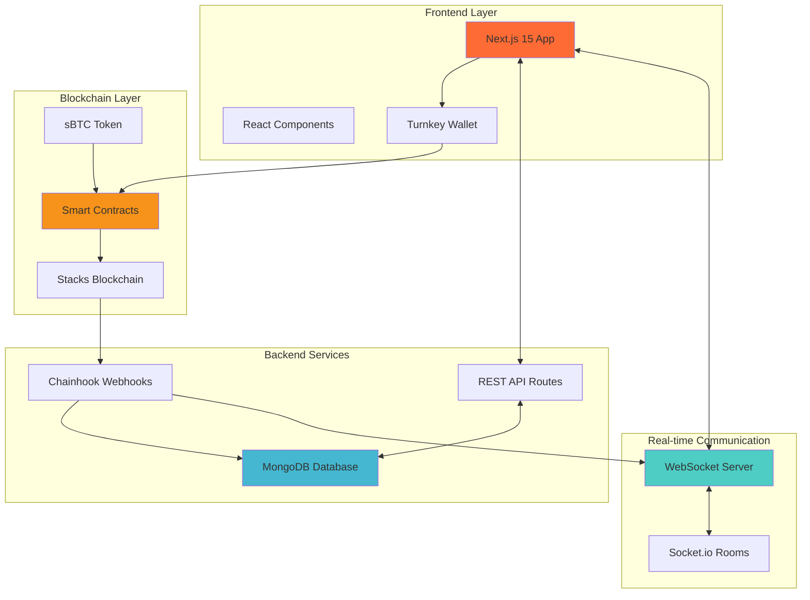
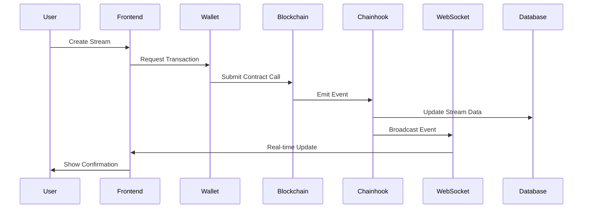
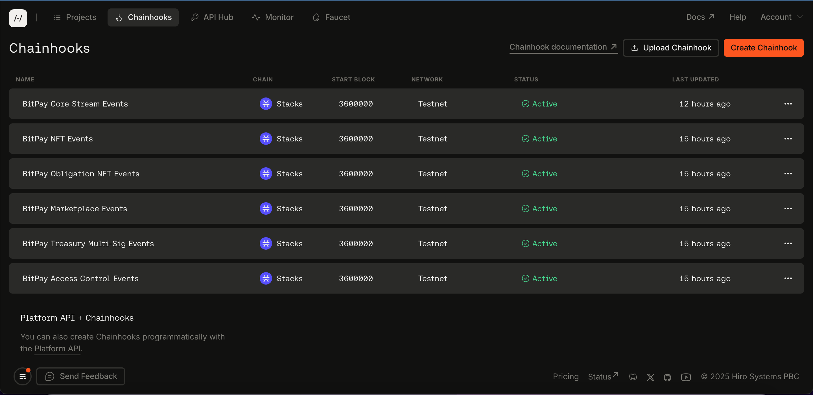
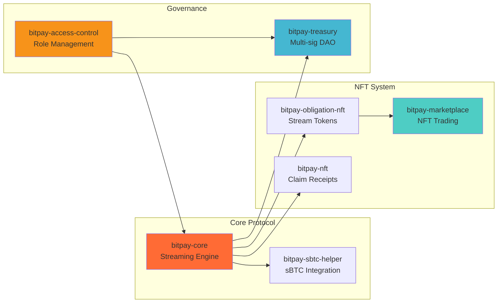

# BitPay - Bitcoin Streaming & Vesting Vaults

<div align="center">


[](https://stacks.co)
[](https://sbtc.tech)
[](LICENSE)

**"Netflix for Money, Secured by Bitcoin"**

_Programmable cash flows on Bitcoin • Continuous payments • Token vesting • NFT marketplace_

[Live Demo](https://bitpay-more.vercel.app) • [Documentation](#documentation) • [Architecture](#architecture) • [Smart Contracts](#smart-contracts)

</div>

---

## 📋 Table of Contents

- [Overview](#overview)
- [Why BitPay?](#why-bitpay)
- [Key Features](#key-features)
- [Architecture](#architecture)
- [Project Structure](#project-structure)
- [Smart Contracts](#smart-contracts)
- [Getting Started](#getting-started)
- [Documentation](#documentation)
- [Technology Stack](#technology-stack)
- [Use Cases](#use-cases)
- [Security](#security)
- [Roadmap](#roadmap)
- [Contributing](#contributing)
- [License](#license)

---

## 🎯 Overview

**BitPay** is the first **programmable cash flow primitive** built on Bitcoin, enabling continuous money streams, token vesting, and tradeable future income flows secured by Bitcoin's network.

Instead of one-time lump sum payments, BitPay allows you to:

- 💸 **Stream payments per-second** to recipients
- 🔒 **Lock sBTC** in trustless smart contracts
- ⏱️ **Vest tokens** with linear release schedules
- 🎨 **Trade future income** as NFTs on a marketplace
- 🏦 **Manage treasury** through multi-sig DAO governance

### The Problem

Traditional payments are broken:

- Freelancers risk not getting paid after months of work
- Employees wait 30 days for salaries despite working daily
- Token vesting requires manual execution and trust
- No ability to unlock liquidity from future income streams

### The Solution

BitPay turns **payment moments into payment relationships**:

- Smart contracts guarantee continuous payments
- Recipients withdraw vested amounts anytime
- Senders retain control, can cancel and recover unvested funds
- Stream obligations can be tokenized and traded as NFTs
- All secured by Bitcoin via sBTC integration

---

## 🚀 Why BitPay?

### For Recipients

✅ **Guaranteed payments** - Money is locked in smart contracts
✅ **Continuous income** - Get paid per-second, not monthly
✅ **Instant access** - Withdraw vested amounts anytime
✅ **Liquidity options** - Trade future streams as NFTs

### For Senders

✅ **Risk mitigation** - Cancel bad actors, recover unvested funds
✅ **Accountability** - Only pay for work actually completed
✅ **Flexible control** - Pause, modify, or cancel streams
✅ **Trust-minimized** - Smart contracts eliminate intermediaries

### For the Bitcoin Ecosystem

✅ **First streaming protocol on Bitcoin** - New DeFi primitive
✅ **sBTC utility** - Real use case for Bitcoin settlements
✅ **Composable** - Building block for 1000s of future apps
✅ **Production-ready** - Built for scale, security, and UX

---

## ✨ Key Features

### 🌊 Streaming Payments

- **Per-second vesting** with linear release schedules
- **Real-time calculations** of withdrawable amounts
- **Cancel anytime** with automatic fund distribution
- **Stream templates** for common payment patterns

### 🎨 NFT Marketplace

- **Stream Obligation NFTs** - Tradeable future income
- **Claim NFTs** - Receipts of completed streams
- **Price discovery** for vested income streams
- **Instant liquidity** for recipients

### 🏦 DAO Treasury Management

- **Multi-signature governance** for protocol fees
- **Proposal system** for treasury withdrawals
- **Transparent fee collection** (0.1% default)
- **Admin role management** with access control

### 📊 Real-Time Updates

- **WebSocket integration** for live stream tracking
- **Chainhook events** for blockchain monitoring
- **Push notifications** for important events
- **Analytics dashboard** with comprehensive metrics

### 🔐 Security First

- **Auditable contracts** with comprehensive test coverage
- **Role-based access control** for sensitive operations
- **Safe math operations** preventing overflows
- **Circuit breakers** for emergency situations

---

## 🏗️ Architecture

BitPay consists of three main components that work together to provide a seamless streaming payment experience:



### System Flow Diagram



### Chainhook Event Processing



The diagram above shows how Chainhook monitors the Stacks blockchain for BitPay contract events and processes them in real-time.

### Component Overview

1. **Frontend (Next.js 15)**

   - User interface for creating and managing streams
   - Real-time dashboard with WebSocket updates
   - Turnkey wallet integration for seamless UX
   - Comprehensive analytics and reporting

2. **Smart Contracts (Clarity)**

   - 7 production-ready contracts on Stacks blockchain
   - Core streaming logic with per-second vesting
   - NFT marketplace for trading future income
   - Multi-sig treasury with DAO governance

3. **WebSocket Server (Socket.io)**

   - Real-time event broadcasting
   - Room-based subscriptions (users, streams, marketplace)
   - HTTP webhooks for external integrations
   - Health monitoring and graceful shutdown

4. **Chainhook Webhooks**
   - Listens to blockchain events
   - Processes contract calls and updates database
   - Triggers WebSocket broadcasts
   - Sends email notifications

See [docs/ARCHITECTURE.md](docs/ARCHITECTURE.md) for detailed system design and data flow diagrams.

---

## 📁 Project Structure

```
bitpay/
├── contract/                      # Smart contracts
│   ├── contracts/
│   │   ├── bitpay-core.clar      # Main streaming logic
│   │   ├── bitpay-treasury.clar  # Multi-sig treasury
│   │   ├── bitpay-marketplace.clar # NFT marketplace
│   │   ├── bitpay-nft.clar       # Claim NFTs
│   │   ├── bitpay-obligation-nft.clar # Stream NFTs
│   │   ├── bitpay-sbtc-helper.clar # sBTC integration
│   │   └── bitpay-access-control.clar # Role management
│   ├── tests/                    # Contract tests
│   └── docs/                     # Contract documentation
│
├── bitpay-frontend/              # Next.js application
│   ├── app/
│   │   ├── dashboard/           # User dashboard
│   │   ├── streams/             # Stream explorer
│   │   ├── docs/                # Documentation site
│   │   └── api/
│   │       ├── webhooks/        # Chainhook endpoints
│   │       ├── streams/         # Stream API
│   │       ├── marketplace/     # Marketplace API
│   │       └── treasury/        # Treasury API
│   ├── components/              # React components
│   ├── hooks/                   # Custom React hooks
│   ├── lib/                     # Utility functions
│   └── models/                  # MongoDB models
│
├── bitpay-websocket-server/     # WebSocket server
│   ├── server.js                # Socket.io server
│   └── render.yaml              # Deployment config
│
├── docs/                        # Documentation
│   ├── ARCHITECTURE.md          # System architecture
│   ├── CONTRACTS.md             # Contract documentation
│   ├── FRONTEND.md              # Frontend guide
│   ├── WEBHOOKS.md              # Webhook integration
│   ├── WEBSOCKET.md             # WebSocket guide
│   └── DEPLOYMENT.md            # Deployment instructions
│
├── .env.example                 # Environment template
├── PITCH_DECK.md                # Hackathon pitch
└── README.md                    # This file
```

---

## 📜 Smart Contracts

BitPay includes **7 production-ready Clarity smart contracts**:



### 1. **bitpay-core** - Streaming Engine

The heart of BitPay. Handles stream creation, vesting calculations, withdrawals, and cancellations.

**Key Functions:**

- `create-stream` - Lock sBTC and start streaming
- `withdraw-from-stream` - Claim vested amount
- `cancel-stream` - Stop stream, return unvested funds
- `get-withdrawable-amount` - Calculate vested amount

### 2. **bitpay-treasury** - DAO Governance

Multi-signature treasury for managing protocol fees collected from streams.

**Key Functions:**

- `add-admin` / `remove-admin` - Manage signers
- `create-withdrawal-proposal` - Propose treasury spend
- `approve-proposal` - Admin voting
- `execute-proposal` - Execute after threshold met

### 3. **bitpay-marketplace** - NFT Trading

Marketplace for buying/selling stream obligation NFTs (future income streams).

**Key Functions:**

- `list-stream` - List stream NFT for sale
- `update-listing` - Change price
- `cancel-listing` - Delist NFT
- `purchase-stream` - Buy listed stream

### 4. **bitpay-nft** - Claim Receipts

Non-transferable NFTs minted as receipts when streams complete or are cancelled.

### 5. **bitpay-obligation-nft** - Stream Tokens

Transferable NFTs representing the recipient's right to withdraw from a stream.

### 6. **bitpay-sbtc-helper** - Bitcoin Integration

Helper contract for sBTC token transfers and balance checks.

### 7. **bitpay-access-control** - Role Management

Centralized access control for admin operations across all contracts.

See [docs/CONTRACTS.md](docs/CONTRACTS.md) for detailed contract documentation and flow diagrams.

---

## 🚀 Getting Started

### Prerequisites

- **Node.js** 18+ and npm
- **MongoDB** (local or Atlas)
- **Clarinet** (for contract development)
- **Stacks Wallet** (Hiro Wallet or similar)

### Quick Start

#### 1. Clone the Repository

```bash
git clone https://github.com/Ifeoma-star/BitpayMore.git
cd BitpayMore
```

#### 2. Setup Smart Contracts

```bash
cd contract
npm install
clarinet test  # Run contract tests
clarinet deploy --testnet  # Deploy to testnet
```

#### 3. Setup Frontend

```bash
cd ../bitpay-frontend
npm install

# Copy environment template
cp .env.example .env.local

# Edit .env.local with your values
# Required: MONGODB_URI, NEXTAUTH_SECRET, NEXT_PUBLIC_BITPAY_DEPLOYER_ADDRESS

npm run dev  # Start development server
```

Visit `http://localhost:3000`

#### 4. Setup WebSocket Server

```bash
cd ../bitpay-websocket-server
npm install

# Create .env file
echo "PORT=4000" > .env
echo "ALLOWED_ORIGINS=http://localhost:3000" >> .env

npm start  # Start WebSocket server
```

### Environment Setup

Copy `.env.example` to `.env.local` and configure:

**Required Variables:**

```env
# Database
MONGODB_URI=mongodb://localhost:27017/bitpay-local

# Authentication
NEXTAUTH_SECRET=your-secret-min-32-chars
JWT_SECRET=your-jwt-secret-min-32-chars

# Blockchain
NEXT_PUBLIC_STACKS_NETWORK=testnet
NEXT_PUBLIC_BITPAY_DEPLOYER_ADDRESS=ST2F3J1PK46D6XVRBB9SQ66PY89P8G0EBDW5E05M7
NEXT_PUBLIC_SBTC_TOKEN_ADDRESS=ST1F7QA2MDF17S807EPA36TSS8AMEFY4KA9TVGWXT

# WebSocket
NEXT_PUBLIC_SOCKET_URL=http://localhost:4000
```

**Optional Variables:**

- Turnkey configuration (for embedded wallets)
- Chainhook webhooks (for blockchain monitoring)
- Email service (for notifications)

See `.env.example` for complete configuration options.

---

## 📚 Documentation

Comprehensive documentation is available in the `/docs` directory:

| Document                                | Description                                                      |
| --------------------------------------- | ---------------------------------------------------------------- |
| [ARCHITECTURE.md](docs/ARCHITECTURE.md) | System architecture, component interaction, data flow diagrams   |
| [CONTRACTS.md](docs/CONTRACTS.md)       | Smart contract documentation, function references, flow diagrams |
| [WEBHOOKS.md](docs/WEBHOOKS.md)         | Chainhook integration, webhook processing, event handlers        |
| [WEBSOCKET.md](docs/WEBSOCKET.md)       | Real-time communication, room management, event broadcasting     |
| [DEPLOYMENT.md](docs/DEPLOYMENT.md)     | Production deployment guide, monitoring, troubleshooting         |

### Additional Resources

- **Live Demo:** [bitpay-more.vercel.app](https://bitpay-more.vercel.app)
- **Interactive Docs:** [bitpay-more.vercel.app/docs](https://bitpay-more.vercel.app/docs)
- **Stream Explorer:** [bitpay-more.vercel.app/streams](https://bitpay-more.vercel.app/streams)
- **Pitch Deck:** [PITCH_DECK.md](PITCH_DECK.md)

---

## 🛠️ Technology Stack

### Smart Contracts

- **Clarity** - Smart contract language (secure, decidable)
- **Stacks Blockchain** - Bitcoin-secured L2
- **sBTC** - Native Bitcoin asset on Stacks
- **Clarinet** - Development and testing framework

### Frontend

- **Next.js 15** - React framework with App Router
- **TypeScript** - Type-safe development
- **Tailwind CSS** - Utility-first styling
- **Shadcn/UI** - Component library
- **Framer Motion** - Animations
- **stacks.js** - Blockchain interaction
- **Turnkey** - Embedded wallet infrastructure

### Backend

- **MongoDB** - Document database
- **Node.js** - Runtime environment
- **NextAuth** - Authentication
- **Socket.io** - WebSocket server
- **Chainhook** - Blockchain event streaming

### Infrastructure

- **Vercel** - Frontend hosting
- **Render** - WebSocket server hosting
- **MongoDB Atlas** - Database hosting
- **Hiro Platform** - Stacks API and Chainhook

---

## 💼 Use Cases

### 1. Employee Payroll

**Problem:** Employees wait 30 days for salaries
**Solution:** Stream salary per-second, withdraw anytime
**Benefit:** Improves cash flow, reduces financial anxiety

### 2. Token Vesting

**Problem:** Manual vesting, requires trust
**Solution:** Automated linear vesting in smart contracts
**Benefit:** Trustless, transparent, instantly verifiable

### 3. Freelance Contracts

**Problem:** Pay upfront and hope, or work and pray
**Solution:** Stream payment as work progresses
**Benefit:** Both parties protected, aligns incentives

### 4. Subscription Services

**Problem:** Monthly billing, poor user experience
**Solution:** Continuous streaming with instant cancellation
**Benefit:** Fair billing, better UX, reduced churn

### 5. Grant Distribution

**Problem:** DAOs struggle with milestone-based funding
**Solution:** Stream grants with cancellation option
**Benefit:** Continuous accountability, risk mitigation

### 6. Income Advance

**Problem:** Need lump sum from future income stream
**Solution:** Trade stream obligation NFT on marketplace
**Benefit:** Instant liquidity without traditional loans

---

## 🔐 Security

Security is our top priority. BitPay implements multiple layers of protection:

### Smart Contract Security

✅ **Comprehensive test coverage** - 90%+ coverage across all contracts
✅ **Safe math operations** - Prevents overflows and underflows
✅ **Access control** - Role-based permissions for sensitive operations
✅ **Input validation** - Strict checks on all user inputs
✅ **Reentrancy protection** - Guards against reentrancy attacks
✅ **Circuit breakers** - Emergency pause functionality

### Application Security

✅ **Authentication** - Wallet-based and OAuth options
✅ **Authorization** - Role-based access control
✅ **Data encryption** - Sensitive data encrypted at rest
✅ **API rate limiting** - Prevents abuse
✅ **CSRF protection** - Token-based request validation
✅ **Environment isolation** - Secrets never in code

### Monitoring & Response

✅ **Real-time alerts** - WebSocket health monitoring
✅ **Error tracking** - Comprehensive logging
✅ **Blockchain monitoring** - Chainhook event processing
✅ **Graceful degradation** - Fallback mechanisms

**Audit Status:** Pre-audit (audit planned post-hackathon)

See [contract/docs/SECURITY_DEPLOYMENT_GUIDE.md](contract/docs/SECURITY_DEPLOYMENT_GUIDE.md) for detailed security considerations.

---

## 🗺️ Roadmap

### Phase 1: Foundation (Current)

✅ Core streaming functionality
✅ NFT marketplace
✅ Multi-sig treasury
✅ Real-time WebSocket updates
✅ Comprehensive documentation

### Phase 2: Enhancement (Q1 2025)

🔲 Professional security audit
🔲 Mainnet deployment
🔲 Mobile app (React Native)
🔲 Advanced analytics dashboard
🔲 Stream templates marketplace

### Phase 3: Scale (Q2 2025)

🔲 Cross-chain bridges (Ethereum, Solana)
🔲 Lending protocol (borrow against streams)
🔲 Developer SDK and API
🔲 White-label solutions
🔲 Enterprise features

### Phase 4: Ecosystem (Q3 2025)

🔲 DAO governance token
🔲 Liquidity mining incentives
🔲 Partner integrations
🔲 Grant program for builders
🔲 Educational content and tutorials

---

## 🤝 Contributing

We welcome contributions from the community! Here's how you can help:

### Ways to Contribute

1. **🐛 Report bugs** - Open an issue with reproduction steps
2. **💡 Suggest features** - Share your ideas for improvements
3. **📖 Improve docs** - Fix typos, add examples, clarify explanations
4. **🧪 Write tests** - Increase test coverage
5. **💻 Submit PRs** - Fix bugs or implement features

### Development Setup

```bash
# Fork and clone the repo
git clone https://github.com/Ifeoma-star/BitpayMore.git
cd BitpayMore

# Create a feature branch
git checkout -b feature/your-feature-name

# Make your changes and test thoroughly
npm test

# Commit with descriptive message
git commit -m "Add: your feature description"

# Push and create PR
git push origin feature/your-feature-name
```

### Code Standards

- **TypeScript** - Use strict type checking
- **Testing** - Maintain 80%+ coverage
- **Documentation** - Update docs for new features
- **Commit Messages** - Follow conventional commits
- **Code Style** - Follow existing patterns

---

## 📄 License

This project is licensed under the **MIT License** - see the [LICENSE](LICENSE) file for details.

---

## 🙏 Acknowledgments

- **Stacks Foundation** - For the Vibe Coding Hackathon
- **Hiro Systems** - For excellent Stacks tooling
- **Turnkey** - For embedded wallet infrastructure
- **Sablier** - Inspiration for streaming payments concept
- **Open Source Community** - For amazing tools and libraries

---

## 📞 Contact

**Team:**
- **Lead Developer:** THEOPHILUS UCHECHUKWU | TeSofTech | thesoftnode@gmail.com
- **Co-Developer:** Naomi Ujah | ujahnaomi104@gmail.com

**Location:** Lagos, Nigeria

**Links:**

- 🌐 **Website:** [bitpay-more.vercel.app](https://bitpay-more.vercel.app)
- 📚 **Documentation:** [bitpay-more.vercel.app/docs](https://bitpay-more.vercel.app/docs)
- 💻 **GitHub:** [github.com/Ifeoma-star/BitpayMore](https://github.com/Ifeoma-star/BitpayMore)
- 📺 **Demo Video:** [Loom Video](https://www.loom.com/share/74202e61407143009db5f5c4724951e3)
- 🐦 **Twitter:** [@TheSoft_Theo](https://x.com/TheSoft_Theo) | [@zibahvalerie](https://x.com/zibahvalerie)

---

## 🎯 Project Goals

BitPay was built for the **Stacks Vibe Coding Hackathon** with the following goals:

✅ **Unlock Bitcoin Economy** - First streaming payment primitive on Bitcoin
✅ **Showcase sBTC** - Real-world use case for Bitcoin settlements
✅ **Demonstrate Vibe Coding** - Built with Claude + Cursor AI tools
✅ **Production Quality** - Not just a demo, a real product
✅ **Open Source** - Available for community to build upon

---

<div align="center">

**Built with ❤️ on Bitcoin • Powered by Stacks & sBTC**

</div>
