# BitPay System Architecture

This document provides a comprehensive overview of BitPay's system architecture, component interactions, and data flows with detailed diagrams.

---

## Table of Contents

1. [System Overview](#system-overview)
2. [High-Level Architecture](#high-level-architecture)
3. [Component Architecture](#component-architecture)
4. [Data Flow Diagrams](#data-flow-diagrams)
5. [Database Schema](#database-schema)
6. [Integration Points](#integration-points)
7. [Security Architecture](#security-architecture)
8. [Scalability Considerations](#scalability-considerations)

---

## System Overview

BitPay is a **distributed system** consisting of multiple interconnected components that work together to provide continuous Bitcoin streaming payments. The system follows a **microservices-inspired architecture** with clear separation of concerns.

### Core Components

1. **Smart Contracts (Clarity)** - On-chain logic and state
2. **Frontend Application (Next.js)** - User interface and client logic
3. **WebSocket Server (Socket.io)** - Real-time event broadcasting
4. **Database (MongoDB)** - Off-chain data storage and indexing
5. **Chainhook Service** - Blockchain event monitoring
6. **External Services** - Turnkey, Hiro API, Email

---

## High-Level Architecture

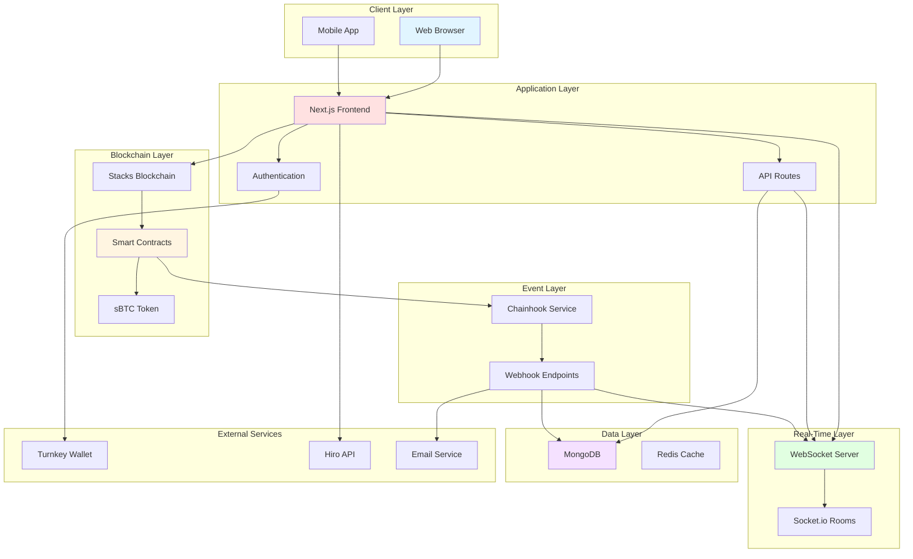

---

## Component Architecture

### 1. Frontend Architecture

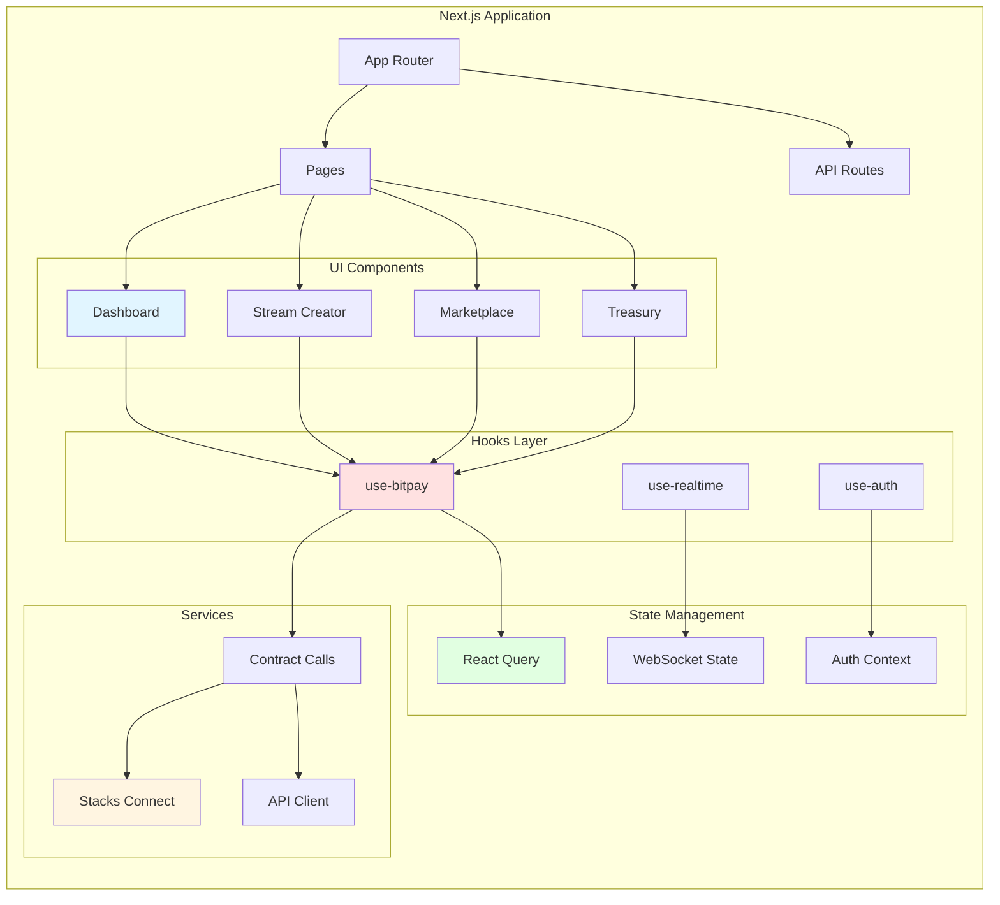

### 2. Smart Contract Architecture

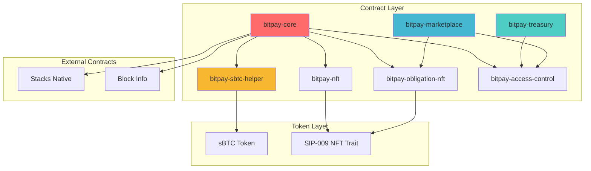

---

## Data Flow Diagrams

### 1. Stream Creation Flow

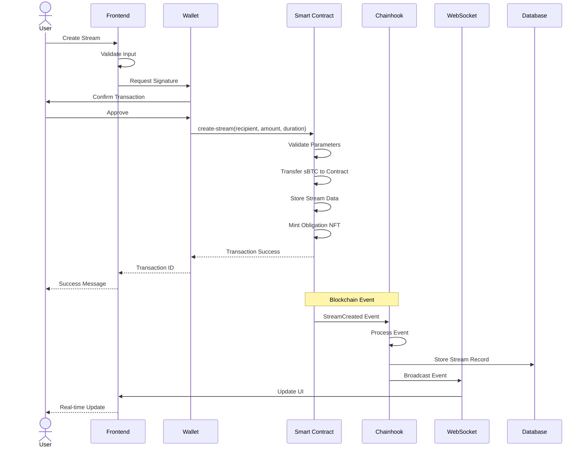

### 2. Withdrawal Flow

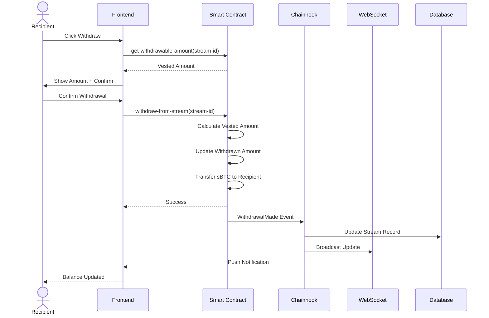

### 3. Chainhook Event Processing Flow

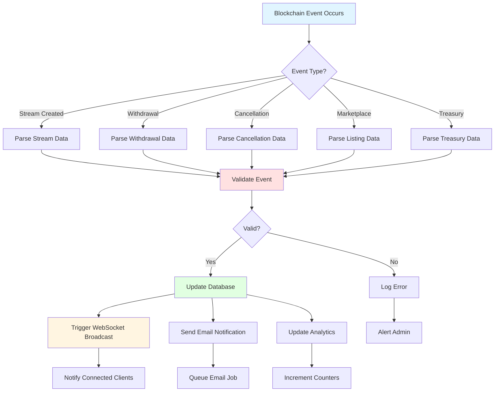

### 4. Real-Time Update Flow

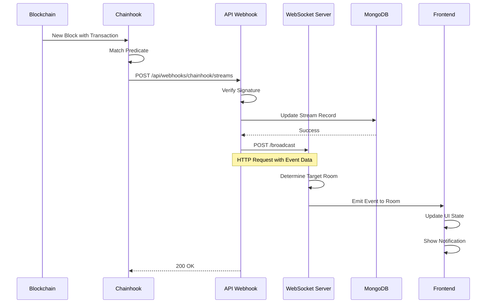

---

## Database Schema

### MongoDB Collections

#### 1. **users**
```javascript
{
  _id: ObjectId,
  walletAddress: String,          // Stacks address (primary key)
  email: String,                   // Optional email
  username: String,                // Optional username
  createdAt: Date,
  updatedAt: Date,
  preferences: {
    notifications: Boolean,
    theme: String
  }
}
```

#### 2. **streams**
```javascript
{
  _id: ObjectId,
  streamId: Number,                // On-chain stream ID
  sender: String,                  // Sender address
  recipient: String,               // Recipient address
  amount: Number,                  // Total sBTC amount (in satoshis)
  startBlock: Number,              // Start block height
  endBlock: Number,                // End block height
  withdrawnAmount: Number,         // Amount withdrawn so far
  status: String,                  // 'active', 'completed', 'cancelled'
  cancelledAtBlock: Number,        // Block when cancelled (if applicable)
  createdAt: Date,
  updatedAt: Date,

  // Denormalized for queries
  duration: Number,                // endBlock - startBlock
  withdrawableAmount: Number,      // Calculated vested amount
  percentComplete: Number          // Progress percentage
}
```

#### 3. **listings**
```javascript
{
  _id: ObjectId,
  listingId: Number,               // On-chain listing ID
  streamId: Number,                // Associated stream
  seller: String,                  // Seller address
  price: Number,                   // Sale price in sBTC
  status: String,                  // 'active', 'sold', 'cancelled'
  createdAt: Date,
  updatedAt: Date,
  soldTo: String,                  // Buyer address (if sold)
  soldAt: Date                     // Sale timestamp (if sold)
}
```

#### 4. **treasury_proposals**
```javascript
{
  _id: ObjectId,
  proposalId: Number,              // On-chain proposal ID
  recipient: String,               // Withdrawal recipient
  amount: Number,                  // Proposed withdrawal amount
  description: String,             // Proposal description
  proposer: String,                // Proposer address
  approvals: [String],             // Array of approver addresses
  status: String,                  // 'pending', 'approved', 'executed', 'cancelled'
  executedAt: Date,
  createdAt: Date,
  updatedAt: Date
}
```

### Database Relationships

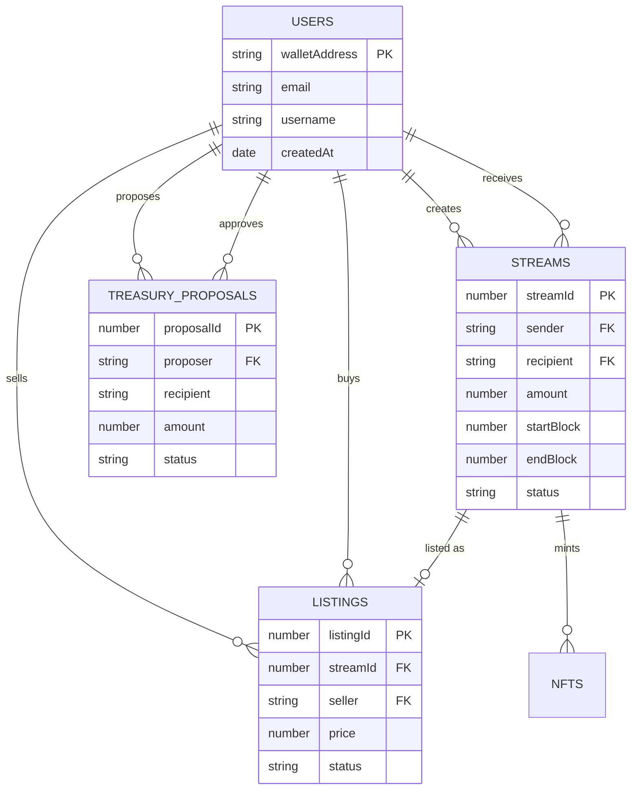

---

## Integration Points

### 1. Stacks Blockchain Integration

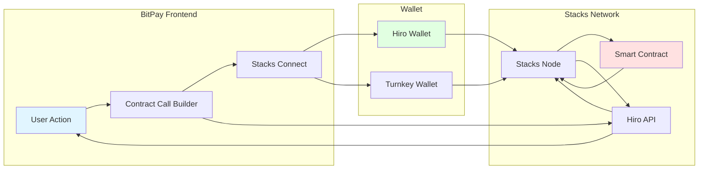

### 2. Turnkey Wallet Integration

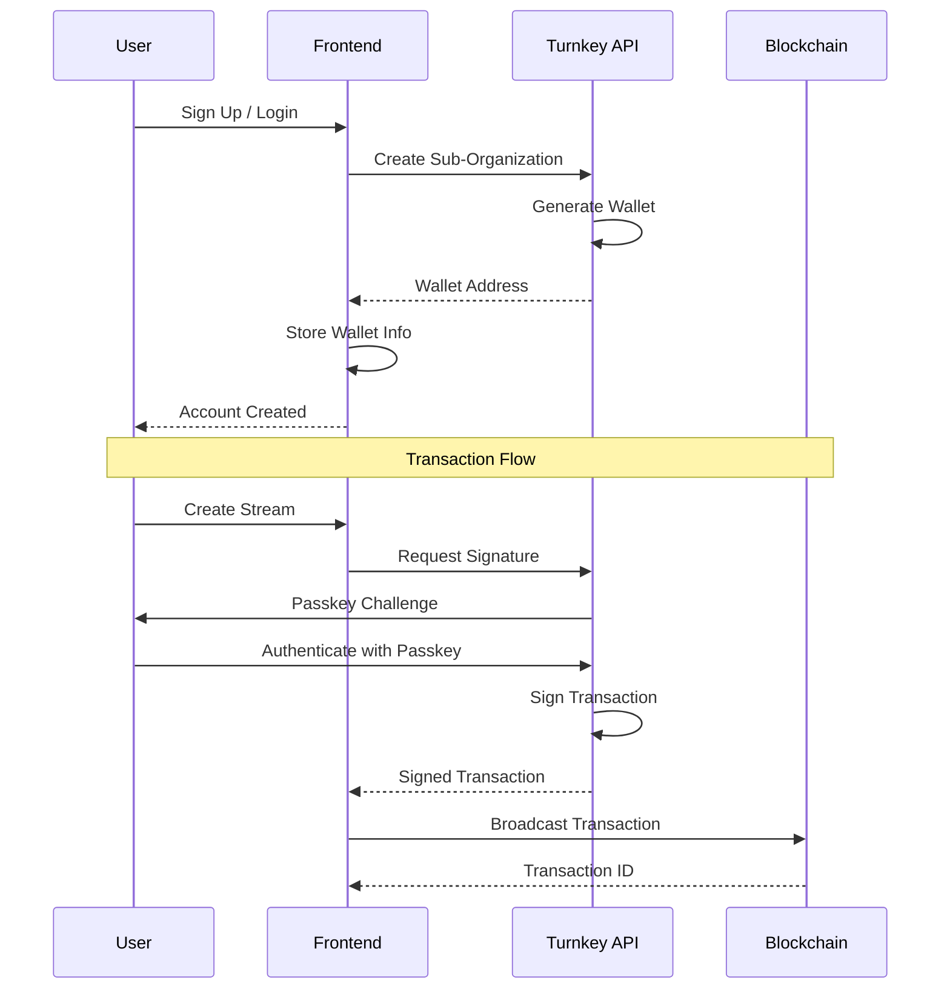

### 3. Chainhook Integration

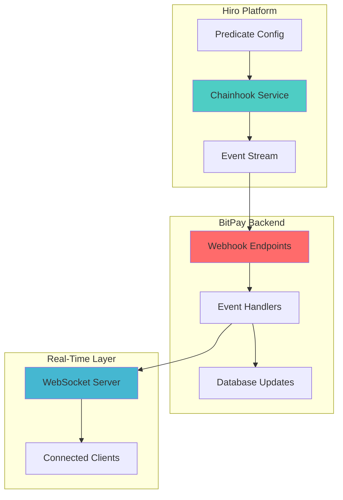

---

## Security Architecture

### Authentication & Authorization Flow

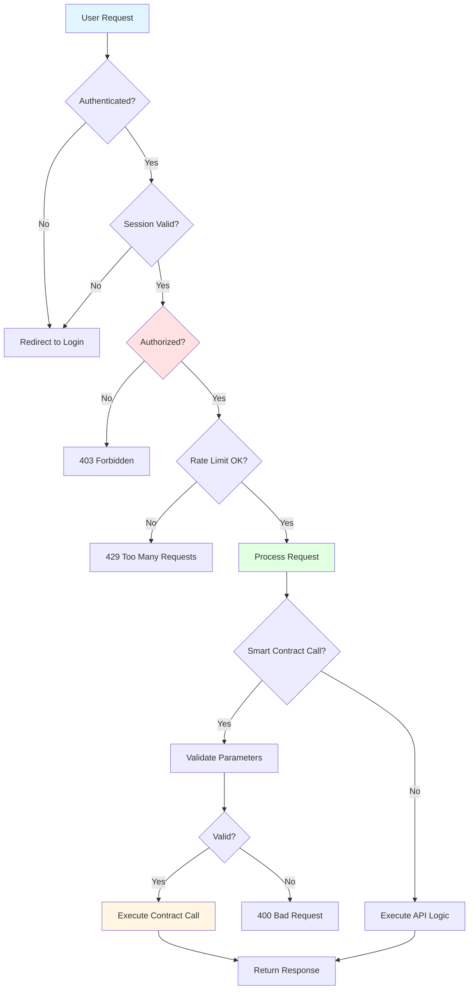

### Security Layers

1. **Network Security**
   - HTTPS/TLS encryption for all communications
   - CORS policies for API endpoints
   - Rate limiting per IP and user

2. **Application Security**
   - JWT-based authentication
   - Role-based access control (RBAC)
   - Input validation and sanitization
   - CSRF token protection

3. **Smart Contract Security**
   - Access control modifiers
   - Safe math operations
   - Reentrancy guards
   - Emergency pause functionality

4. **Data Security**
   - Encrypted storage for sensitive data
   - Environment variable isolation
   - Secrets management (Vercel/Render)
   - Database access controls

---

## Scalability Considerations

### Horizontal Scaling Architecture

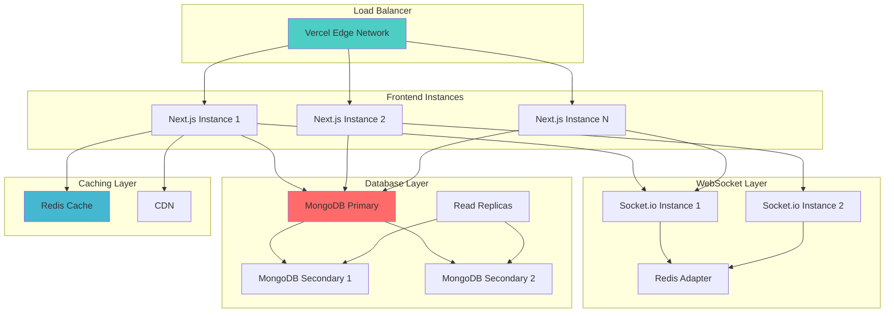

### Performance Optimizations

1. **Frontend Optimizations**
   - Static page generation where possible
   - Incremental static regeneration (ISR)
   - Image optimization with Next.js Image
   - Code splitting and lazy loading
   - React Query for intelligent caching

2. **API Optimizations**
   - Database indexing on frequent queries
   - Connection pooling
   - Response caching with Redis
   - Pagination for large datasets
   - Batch operations where applicable

3. **Blockchain Optimizations**
   - Off-chain calculation of vested amounts
   - Batch read operations
   - Local caching of contract data
   - Optimistic UI updates

4. **Real-Time Optimizations**
   - Room-based event broadcasting
   - Connection state management
   - Automatic reconnection logic
   - Message queuing for offline clients

---

## System Monitoring

### Monitoring Stack

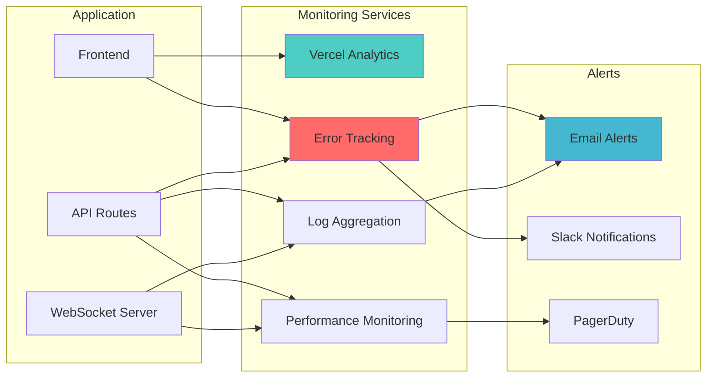

### Key Metrics

1. **Application Metrics**
   - Request latency (p50, p95, p99)
   - Error rates by endpoint
   - Active users and sessions
   - WebSocket connection count

2. **Business Metrics**
   - Streams created per day
   - Total value locked (TVL)
   - Marketplace volume
   - Active users (DAU/MAU)

3. **Infrastructure Metrics**
   - Database query performance
   - API response times
   - WebSocket message latency
   - Server resource utilization

---

## Deployment Architecture

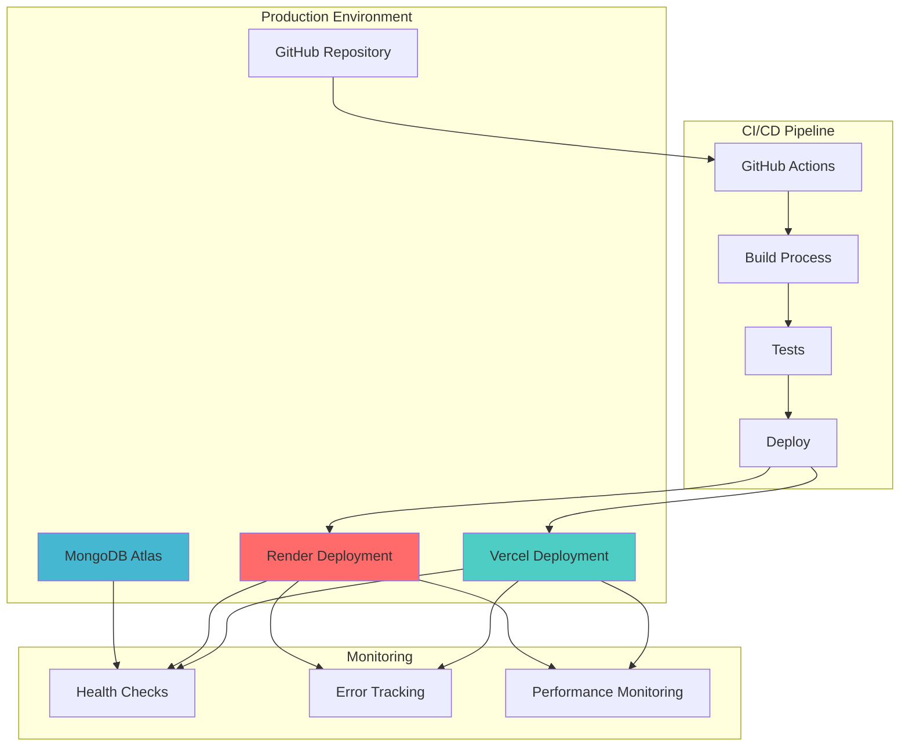

See [DEPLOYMENT.md](DEPLOYMENT.md) for detailed deployment instructions.

---

## Next Steps

- [Smart Contracts Documentation](CONTRACTS.md)
- [Frontend Architecture Guide](FRONTEND.md)
- [Webhook Integration Guide](WEBHOOKS.md)
- [WebSocket Communication Guide](WEBSOCKET.md)
- [Deployment Guide](DEPLOYMENT.md)
