# BitPay Smart Contracts Documentation

Complete technical documentation for all 7 BitPay smart contracts with detailed flow diagrams and function references.

---

## Table of Contents

1. [Contract Overview](#contract-overview)
2. [Contract Architecture](#contract-architecture)
3. [Contract 1: bitpay-core](#contract-1-bitpay-core)
4. [Contract 2: bitpay-treasury](#contract-2-bitpay-treasury)
5. [Contract 3: bitpay-marketplace](#contract-3-bitpay-marketplace)
6. [Contract 4: bitpay-nft](#contract-4-bitpay-nft)
7. [Contract 5: bitpay-obligation-nft](#contract-5-bitpay-obligation-nft)
8. [Contract 6: bitpay-sbtc-helper](#contract-6-bitpay-sbtc-helper)
9. [Contract 7: bitpay-access-control](#contract-7-bitpay-access-control)
10. [Contract Interactions](#contract-interactions)
11. [Error Codes](#error-codes)
12. [Testing Strategy](#testing-strategy)

---

## Contract Overview

BitPay consists of **7 interconnected Clarity smart contracts** that work together to provide streaming payment functionality on Bitcoin via Stacks.

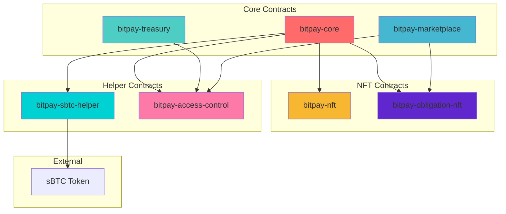

### Contract Responsibilities

| Contract | Primary Function | Key Data |
|----------|-----------------|----------|
| **bitpay-core** | Stream management, vesting calculations | Streams map, stream counter |
| **bitpay-treasury** | Multi-sig governance, fee management | Proposals, admins, treasury balance |
| **bitpay-marketplace** | NFT trading, price discovery | Listings, listing counter |
| **bitpay-nft** | Non-transferable claim receipts | Claim NFTs, metadata |
| **bitpay-obligation-nft** | Transferable stream rights | Stream NFTs, ownership |
| **bitpay-sbtc-helper** | sBTC integration utilities | Token transfers, balances |
| **bitpay-access-control** | Centralized role management | Admin roles, permissions |

---

## Contract Architecture

### Dependency Graph

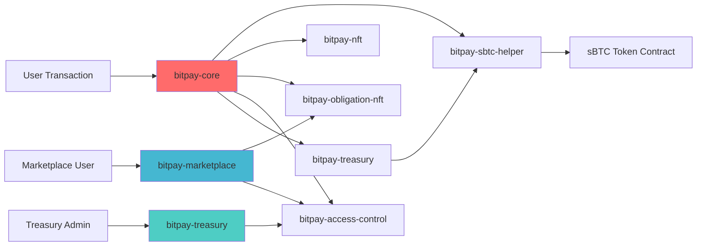

---

## Contract 1: bitpay-core

The **heart of BitPay**. Manages all streaming payment logic including creation, withdrawals, and cancellations.

### Data Structures

```clarity
;; Stream data map
(define-map streams
  { stream-id: uint }
  {
    sender: principal,
    recipient: principal,
    amount: uint,
    start-block: uint,
    end-block: uint,
    withdrawn: uint,
    cancelled: bool,
    cancelled-at-block: (optional uint)
  }
)

;; Stream counter
(define-data-var stream-id-nonce uint u0)

;; Fee configuration
(define-data-var fee-basis-points uint u10) ;; 0.1% default
```

### Core Functions

#### 1. create-stream

Creates a new payment stream by locking sBTC in the contract.

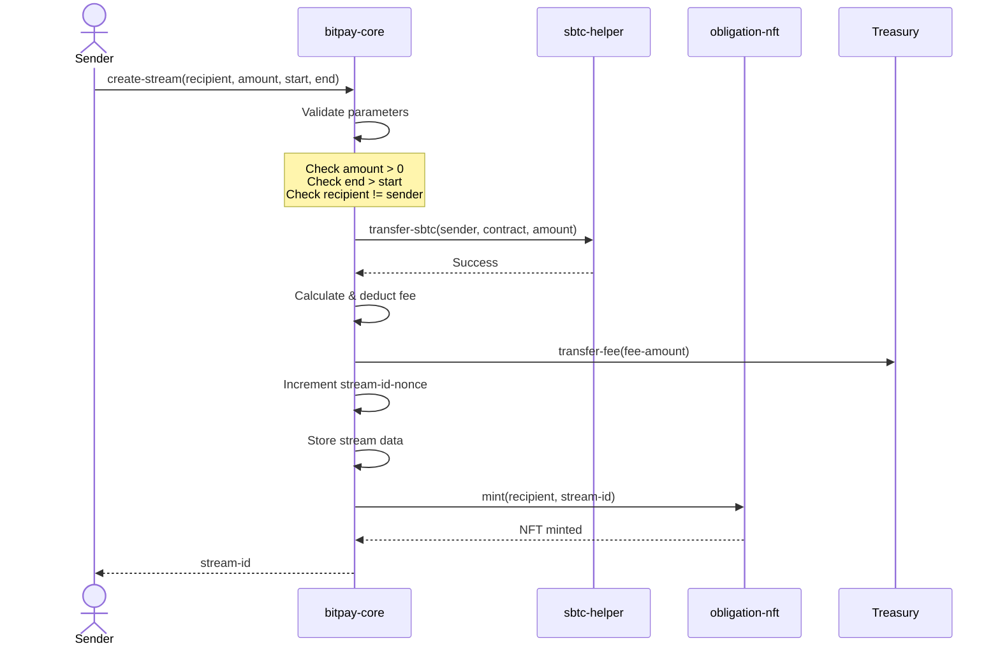

**Parameters:**
- `recipient` (principal) - Stream recipient address
- `amount` (uint) - Total sBTC amount in satoshis
- `start-block` (uint) - Starting block height
- `end-block` (uint) - Ending block height

**Returns:** `(response uint uint)` - Stream ID or error code

**Errors:**
- `err-invalid-amount` (u100)
- `err-invalid-duration` (u101)
- `err-transfer-failed` (u102)
- `err-same-sender-recipient` (u103)

#### 2. withdraw-from-stream

Allows recipient to withdraw vested amount from a stream.

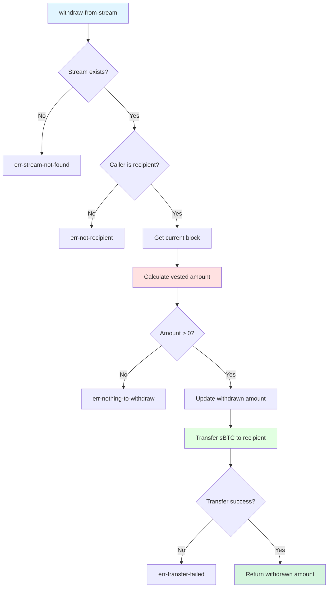

**Vesting Calculation:**

```clarity
(define-read-only (get-withdrawable-amount (stream-id uint))
  (let ((stream (unwrap! (map-get? streams {stream-id: stream-id}) err-stream-not-found))
        (current-block block-height)
        (elapsed (if (get cancelled stream)
                    (default-to u0 (get cancelled-at-block stream))
                    (if (> current-block (get end-block stream))
                        (get end-block stream)
                        current-block))))
    (let ((total-vested (/ (* (get amount stream)
                              (- elapsed (get start-block stream)))
                           (- (get end-block stream) (get start-block stream)))))
      (ok (- total-vested (get withdrawn stream))))))
```

**Formula:**
```
vested_amount = (total_amount × elapsed_blocks) / total_duration_blocks
withdrawable = vested_amount - already_withdrawn
```

#### 3. cancel-stream

Cancels an active stream, returning unvested funds to sender.

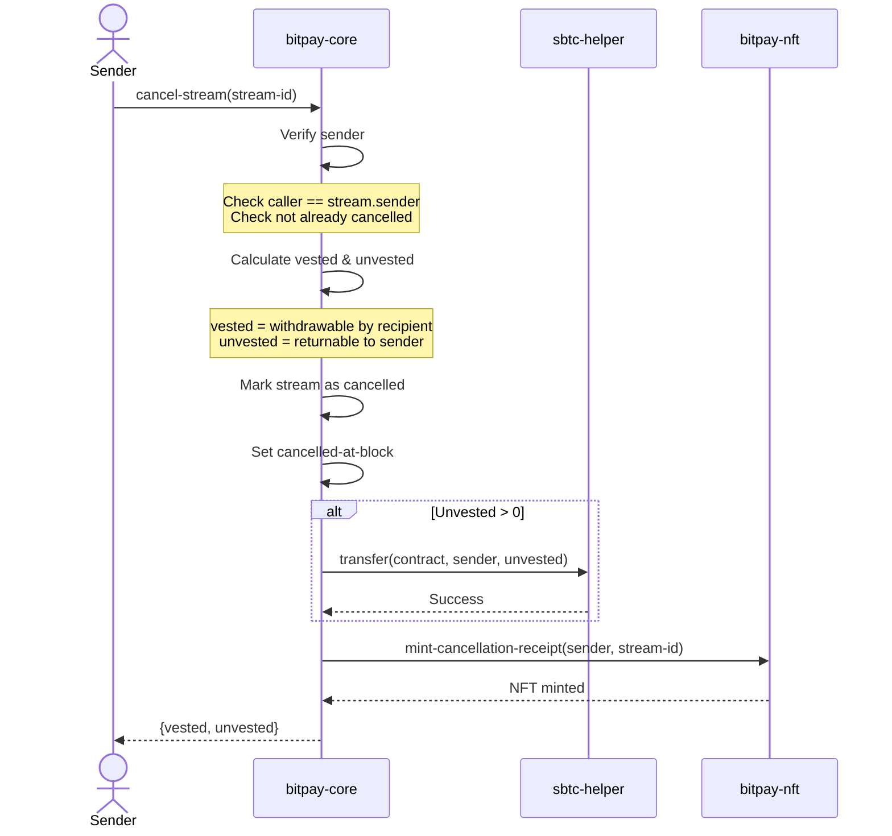

**Cancellation Logic:**
```clarity
;; Calculate amounts at cancellation
(let ((elapsed-blocks (- block-height (get start-block stream)))
      (total-duration (- (get end-block stream) (get start-block stream))))
  (let ((vested (/ (* (get amount stream) elapsed-blocks) total-duration))
        (already-withdrawn (get withdrawn stream)))
    (let ((remaining-vested (- vested already-withdrawn))
          (unvested (- (get amount stream) vested)))
      ;; Return unvested to sender
      ;; Keep vested for recipient to withdraw
    )))
```

### Read-Only Functions

```clarity
;; Get stream details
(define-read-only (get-stream (stream-id uint))
  (map-get? streams {stream-id: stream-id}))

;; Get withdrawable amount
(define-read-only (get-withdrawable-amount (stream-id uint))
  ;; Implementation shown above
)

;; Get stream count
(define-read-only (get-stream-count)
  (var-get stream-id-nonce))

;; Check if stream is active
(define-read-only (is-stream-active (stream-id uint))
  (let ((stream (unwrap! (get-stream stream-id) false)))
    (and (not (get cancelled stream))
         (>= block-height (get start-block stream))
         (< block-height (get end-block stream)))))
```

---

## Contract 2: bitpay-treasury

Multi-signature treasury for managing protocol fees collected from streams.

### Data Structures

```clarity
;; Treasury admins
(define-map admins principal bool)

;; Approval threshold
(define-data-var approval-threshold uint u2)

;; Withdrawal proposals
(define-map proposals
  { proposal-id: uint }
  {
    recipient: principal,
    amount: uint,
    description: (string-utf8 256),
    proposer: principal,
    approvals: (list 10 principal),
    executed: bool,
    created-at: uint
  }
)

(define-data-var proposal-nonce uint u0)
```

### Treasury Flow

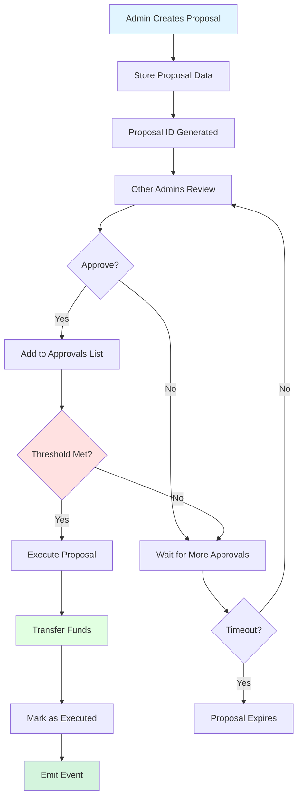

### Key Functions

#### create-withdrawal-proposal

```clarity
(define-public (create-withdrawal-proposal
                (recipient principal)
                (amount uint)
                (description (string-utf8 256)))
  (let ((proposer tx-sender)
        (proposal-id (+ (var-get proposal-nonce) u1)))

    ;; Verify caller is admin
    (asserts! (is-admin proposer) err-not-admin)

    ;; Verify treasury has sufficient balance
    (asserts! (>= (get-treasury-balance) amount) err-insufficient-balance)

    ;; Create proposal
    (map-set proposals
      {proposal-id: proposal-id}
      {
        recipient: recipient,
        amount: amount,
        description: description,
        proposer: proposer,
        approvals: (list proposer),
        executed: false,
        created-at: block-height
      })

    (var-set proposal-nonce proposal-id)
    (ok proposal-id)))
```

#### approve-proposal

```clarity
(define-public (approve-proposal (proposal-id uint))
  (let ((proposal (unwrap! (map-get? proposals {proposal-id: proposal-id})
                           err-proposal-not-found))
        (approver tx-sender))

    ;; Verify caller is admin
    (asserts! (is-admin approver) err-not-admin)

    ;; Verify not already approved by this admin
    (asserts! (is-none (index-of (get approvals proposal) approver))
              err-already-approved)

    ;; Verify not already executed
    (asserts! (not (get executed proposal)) err-already-executed)

    ;; Add approval
    (map-set proposals
      {proposal-id: proposal-id}
      (merge proposal {
        approvals: (unwrap! (as-max-len?
                             (append (get approvals proposal) approver)
                             u10)
                            err-max-approvals)
      }))

    (ok true)))
```

#### execute-proposal

```clarity
(define-public (execute-proposal (proposal-id uint))
  (let ((proposal (unwrap! (map-get? proposals {proposal-id: proposal-id})
                           err-proposal-not-found)))

    ;; Verify threshold met
    (asserts! (>= (len (get approvals proposal)) (var-get approval-threshold))
              err-threshold-not-met)

    ;; Verify not already executed
    (asserts! (not (get executed proposal)) err-already-executed)

    ;; Execute withdrawal
    (try! (contract-call? .bitpay-sbtc-helper transfer-sbtc
           (as-contract tx-sender)
           (get recipient proposal)
           (get amount proposal)))

    ;; Mark as executed
    (map-set proposals
      {proposal-id: proposal-id}
      (merge proposal {executed: true}))

    (ok true)))
```

---

## Contract 3: bitpay-marketplace

NFT marketplace for trading stream obligation NFTs (future income streams).

### Marketplace Flow

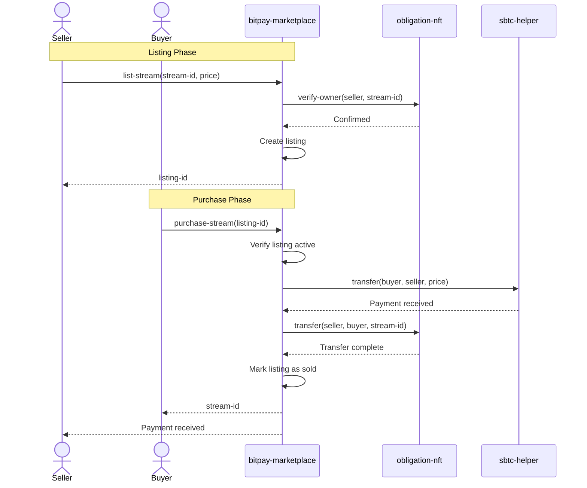

### Data Structures

```clarity
(define-map listings
  { listing-id: uint }
  {
    stream-id: uint,
    seller: principal,
    price: uint,
    status: (string-ascii 10), ;; "active", "sold", "cancelled"
    created-at: uint,
    sold-to: (optional principal),
    sold-at: (optional uint)
  }
)

(define-data-var listing-nonce uint u0)
(define-data-var marketplace-fee-bps uint u25) ;; 0.25% fee
```

### Key Functions

#### list-stream

```clarity
(define-public (list-stream (stream-id uint) (price uint))
  (let ((seller tx-sender)
        (listing-id (+ (var-get listing-nonce) u1)))

    ;; Verify seller owns the stream NFT
    (asserts! (is-eq (try! (contract-call? .bitpay-obligation-nft get-owner stream-id))
                     seller)
              err-not-owner)

    ;; Verify price > 0
    (asserts! (> price u0) err-invalid-price)

    ;; Create listing
    (map-set listings
      {listing-id: listing-id}
      {
        stream-id: stream-id,
        seller: seller,
        price: price,
        status: "active",
        created-at: block-height,
        sold-to: none,
        sold-at: none
      })

    (var-set listing-nonce listing-id)
    (ok listing-id)))
```

#### purchase-stream

```clarity
(define-public (purchase-stream (listing-id uint))
  (let ((listing (unwrap! (map-get? listings {listing-id: listing-id})
                          err-listing-not-found))
        (buyer tx-sender))

    ;; Verify listing is active
    (asserts! (is-eq (get status listing) "active") err-listing-not-active)

    ;; Verify buyer != seller
    (asserts! (not (is-eq buyer (get seller listing))) err-cannot-buy-own)

    ;; Calculate marketplace fee
    (let ((marketplace-fee (/ (* (get price listing) (var-get marketplace-fee-bps)) u10000))
          (seller-amount (- (get price listing) marketplace-fee)))

      ;; Transfer payment from buyer to seller
      (try! (contract-call? .bitpay-sbtc-helper transfer-sbtc
             buyer
             (get seller listing)
             seller-amount))

      ;; Transfer fee to treasury
      (try! (contract-call? .bitpay-sbtc-helper transfer-sbtc
             buyer
             .bitpay-treasury
             marketplace-fee))

      ;; Transfer NFT ownership
      (try! (contract-call? .bitpay-obligation-nft transfer
             (get stream-id listing)
             (get seller listing)
             buyer))

      ;; Update listing status
      (map-set listings
        {listing-id: listing-id}
        (merge listing {
          status: "sold",
          sold-to: (some buyer),
          sold-at: (some block-height)
        }))

      (ok (get stream-id listing)))))
```

---

## Contract 4: bitpay-nft

Non-transferable Claim NFTs minted as receipts when streams complete or are cancelled.

### NFT Structure

```clarity
;; SIP-009 Trait Implementation
(impl-trait .sip-009-trait.nft-trait)

(define-non-fungible-token claim-nft uint)

(define-map token-metadata
  uint
  {
    stream-id: uint,
    recipient: principal,
    event-type: (string-ascii 20), ;; "completed" or "cancelled"
    amount-claimed: uint,
    minted-at: uint
  }
)
```

### Minting Flow

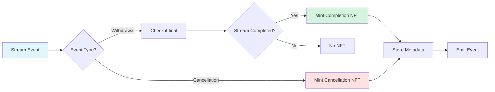

**Key Characteristic:** These NFTs are **non-transferable** - they serve as permanent receipts.

---

## Contract 5: bitpay-obligation-nft

Transferable Stream Obligation NFTs representing the recipient's right to withdraw from a stream.

### NFT Structure

```clarity
(impl-trait .sip-009-trait.nft-trait)

(define-non-fungible-token stream-obligation uint)

(define-map token-owners uint principal)
(define-map token-uri uint (string-ascii 256))
```

### Transfer Mechanism

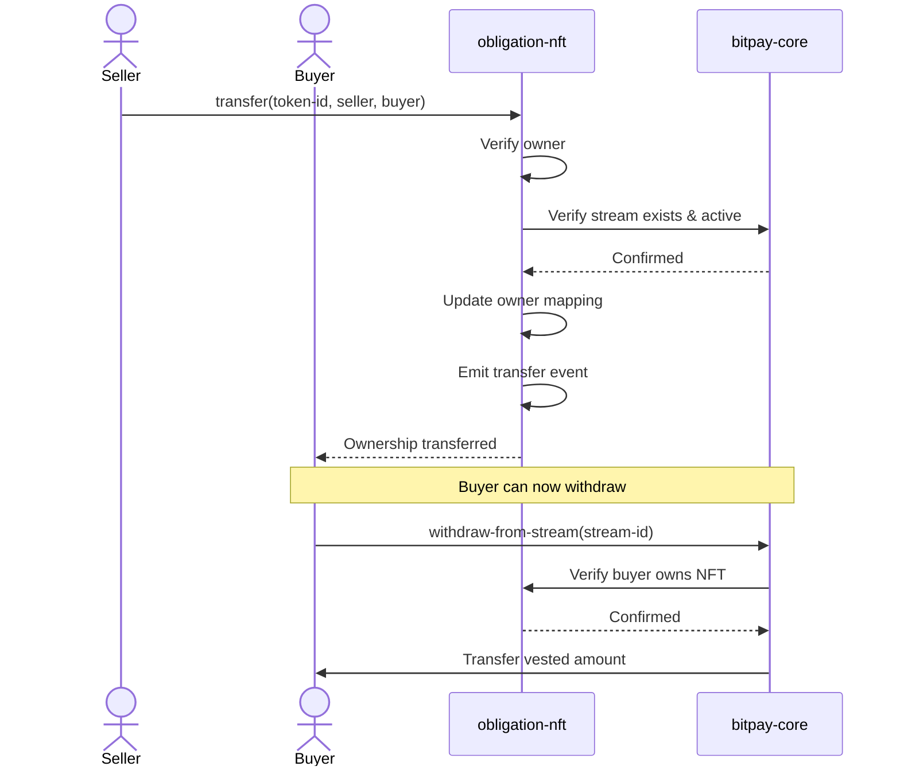

**Key Characteristic:** These NFTs **can be transferred**, enabling a marketplace for future income streams.

---

## Contract 6: bitpay-sbtc-helper

Helper contract providing sBTC token interaction utilities.

### Functions

```clarity
;; Transfer sBTC between addresses
(define-public (transfer-sbtc (sender principal) (recipient principal) (amount uint))
  (contract-call? .sbtc-token transfer amount sender recipient none))

;; Get sBTC balance
(define-read-only (get-balance (account principal))
  (contract-call? .sbtc-token get-balance account))

;; Check if contract has approval
(define-read-only (has-approval (owner principal) (spender principal))
  (contract-call? .sbtc-token get-allowance owner spender))
```

---

## Contract 7: bitpay-access-control

Centralized role-based access control for admin operations.

### Role Structure

```clarity
(define-map admins principal bool)
(define-map operators principal bool)

(define-data-var contract-owner principal tx-sender)
```

### Permission Hierarchy

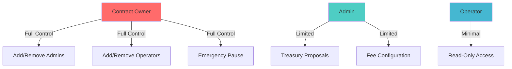

---

## Contract Interactions

### Complete Stream Creation Flow

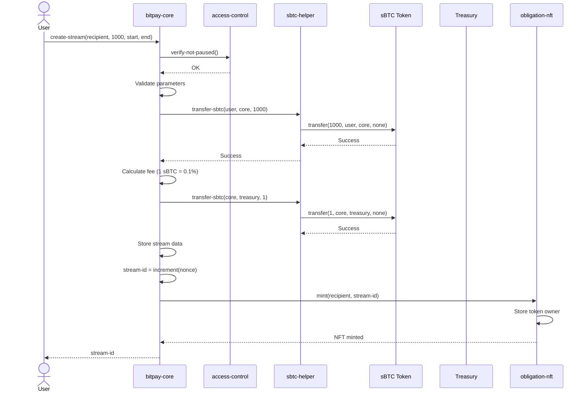

---

## Error Codes

### bitpay-core Errors

| Code | Constant | Description |
|------|----------|-------------|
| u100 | err-invalid-amount | Amount must be greater than 0 |
| u101 | err-invalid-duration | End block must be after start block |
| u102 | err-transfer-failed | sBTC transfer failed |
| u103 | err-same-sender-recipient | Sender and recipient cannot be the same |
| u104 | err-stream-not-found | Stream ID does not exist |
| u105 | err-not-recipient | Caller is not the stream recipient |
| u106 | err-not-sender | Caller is not the stream sender |
| u107 | err-already-cancelled | Stream already cancelled |
| u108 | err-nothing-to-withdraw | No vested amount available |
| u109 | err-not-started | Stream has not started yet |

### bitpay-treasury Errors

| Code | Constant | Description |
|------|----------|-------------|
| u200 | err-not-admin | Caller is not an admin |
| u201 | err-insufficient-balance | Treasury balance too low |
| u202 | err-proposal-not-found | Proposal ID does not exist |
| u203 | err-already-approved | Admin already approved this proposal |
| u204 | err-already-executed | Proposal already executed |
| u205 | err-threshold-not-met | Not enough approvals |
| u206 | err-max-approvals | Maximum approvals reached |

### bitpay-marketplace Errors

| Code | Constant | Description |
|------|----------|-------------|
| u300 | err-not-owner | Caller does not own the NFT |
| u301 | err-invalid-price | Price must be greater than 0 |
| u302 | err-listing-not-found | Listing ID does not exist |
| u303 | err-listing-not-active | Listing is not active |
| u304 | err-cannot-buy-own | Cannot purchase your own listing |
| u305 | err-insufficient-funds | Buyer has insufficient sBTC |

---

## Testing Strategy

### Unit Tests

Each contract has comprehensive unit tests covering:

```clarity
;; Test: Stream creation
(define-test create-stream-success
  ;; Verify stream created with correct parameters
  ;; Verify sBTC transferred
  ;; Verify NFT minted
  ;; Verify fee collected
)

(define-test create-stream-invalid-amount
  ;; Verify error when amount = 0
)

;; Test: Withdrawal
(define-test withdraw-partial
  ;; Advance to 50% duration
  ;; Verify 50% withdrawable
)

(define-test withdraw-full
  ;; Advance past end block
  ;; Verify 100% withdrawable
)

;; Test: Cancellation
(define-test cancel-stream-midway
  ;; Cancel at 30% duration
  ;; Verify 30% to recipient
  ;; Verify 70% to sender
)
```

### Integration Tests

```clarity
;; Test: Complete stream lifecycle
(define-test full-stream-lifecycle
  ;; 1. Create stream
  ;; 2. Partial withdrawal
  ;; 3. List on marketplace
  ;; 4. Purchase by new user
  ;; 5. Final withdrawal by new owner
  ;; 6. Verify all state transitions
)

;; Test: Treasury governance
(define-test treasury-proposal-flow
  ;; 1. Admin creates proposal
  ;; 2. Multiple admins approve
  ;; 3. Execute withdrawal
  ;; 4. Verify balance updated
)
```

### Test Coverage Goals

- **Line Coverage:** >90%
- **Branch Coverage:** >85%
- **Function Coverage:** 100%

---

## Next Steps

- [Frontend Architecture](FRONTEND.md)
- [Webhook Integration](WEBHOOKS.md)
- [WebSocket Communication](WEBSOCKET.md)
- [Deployment Guide](DEPLOYMENT.md)
- [System Architecture](ARCHITECTURE.md)
