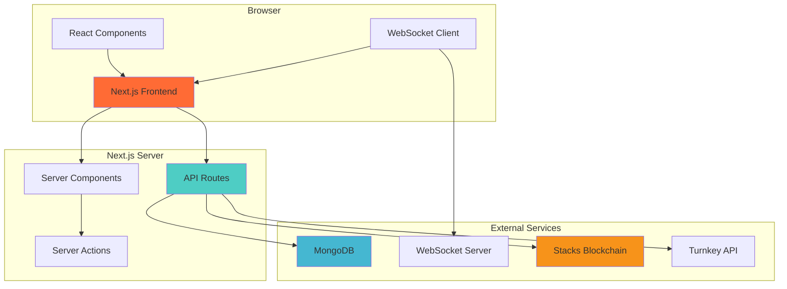
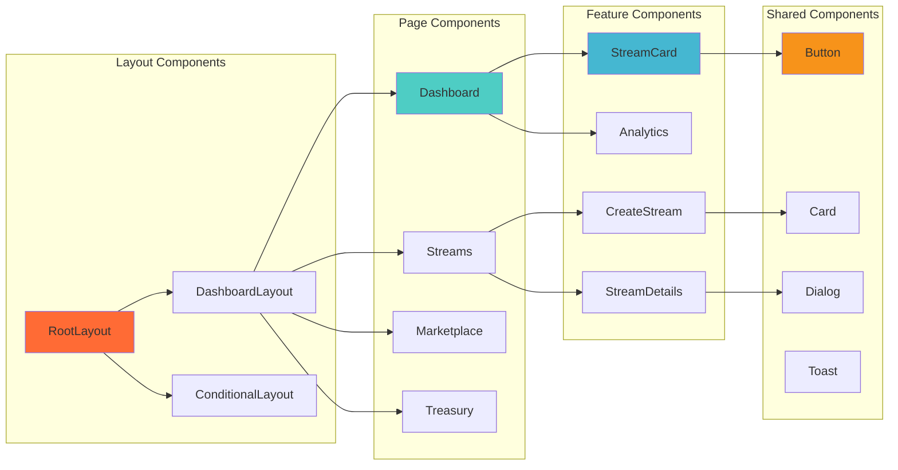
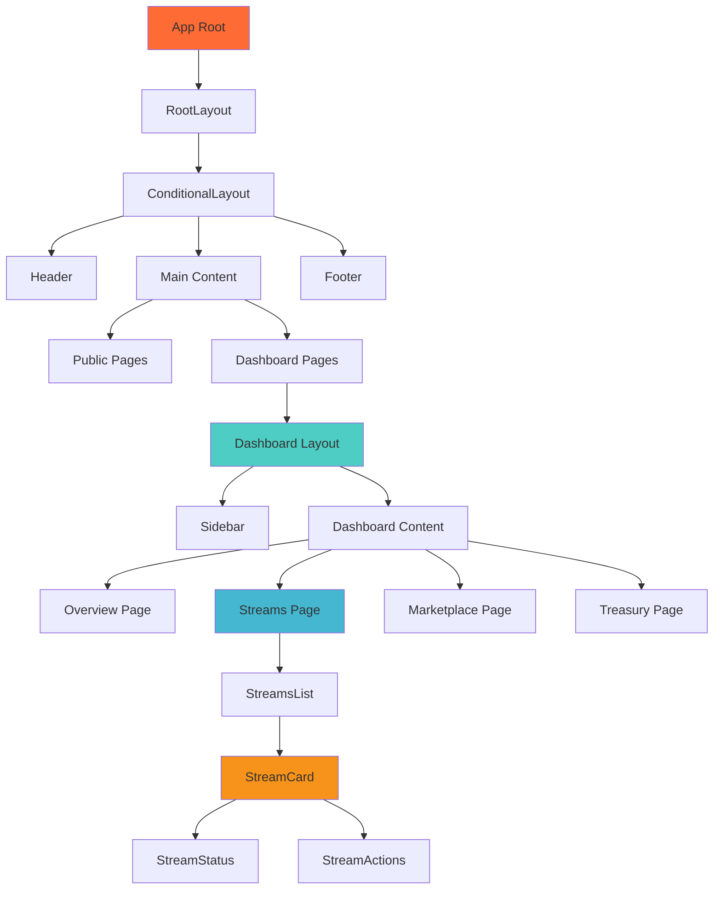
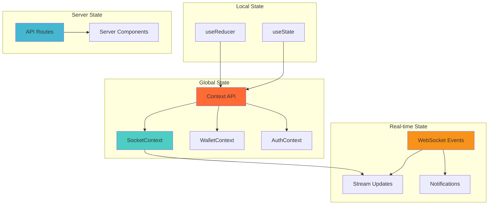
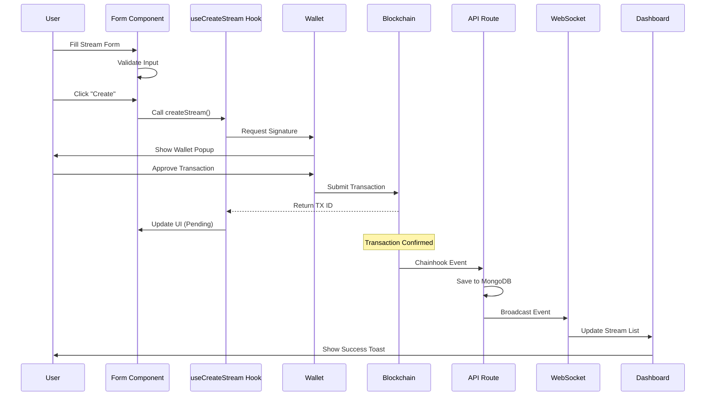
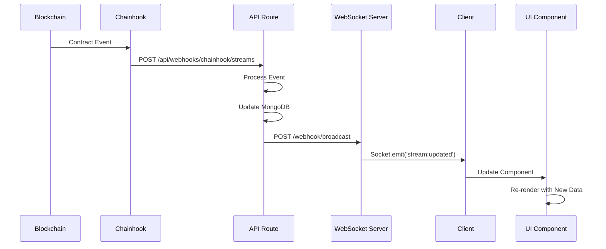
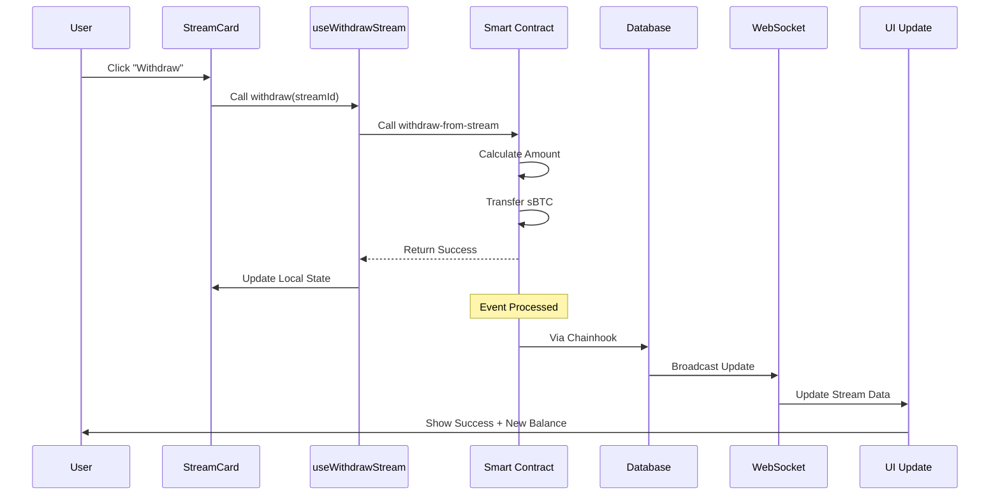
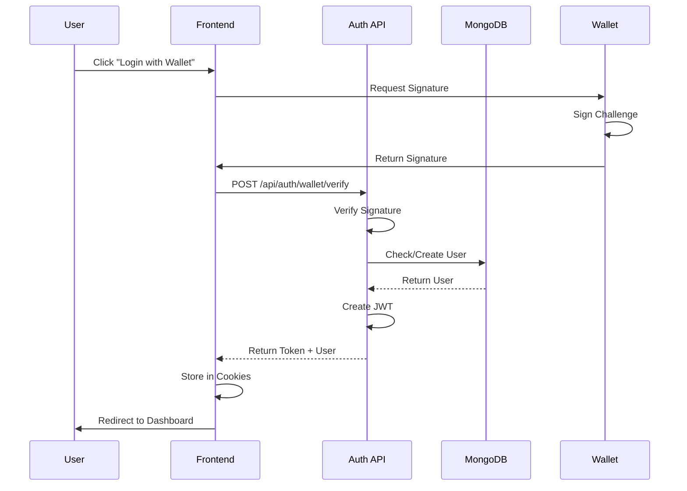
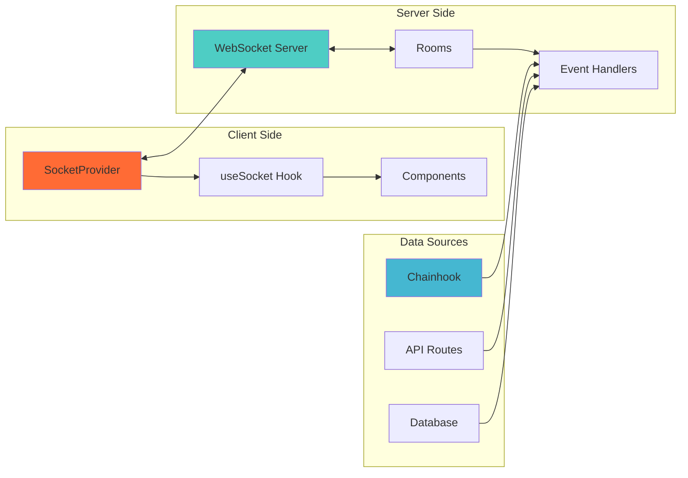

# Frontend Architecture Documentation

## Table of Contents

- [Overview](#overview)
- [Technology Stack](#technology-stack)
- [Architecture](#architecture)
- [Project Structure](#project-structure)
- [Component Design](#component-design)
- [State Management](#state-management)
- [Data Flow](#data-flow)
- [Routing](#routing)
- [Authentication](#authentication)
- [Real-time Updates](#real-time-updates)
- [API Integration](#api-integration)
- [Styling](#styling)
- [Performance Optimizations](#performance-optimizations)

---

## Overview

BitPay's frontend is built with **Next.js 15** using the App Router, providing a modern, performant, and SEO-friendly user experience. The application features real-time updates, embedded wallet integration, and a comprehensive dashboard for managing Bitcoin streams.

### Key Features

- 🚀 **Next.js 15 App Router** - Server and client components with streaming SSR
- 🔐 **Multi-wallet Support** - Turnkey embedded wallets + Hiro Wallet
- ⚡ **Real-time Updates** - WebSocket integration for live stream tracking
- 🎨 **Modern UI** - Tailwind CSS + Shadcn/UI components
- 📊 **Rich Analytics** - Comprehensive dashboard with charts and metrics
- 🔔 **Notifications** - Real-time push notifications for events
- 📱 **Responsive Design** - Mobile-first approach

---

## Technology Stack

### Core Framework

```
Next.js 15.5.4
├── React 18 (Server + Client Components)
├── TypeScript 5.x (Type safety)
├── App Router (File-based routing)
└── Server Actions (Form handling)
```

### UI & Styling

```
Tailwind CSS 3.x
├── Shadcn/UI (Component library)
├── Radix UI (Headless primitives)
├── Lucide Icons (Icon system)
├── Framer Motion (Animations)
└── Recharts (Data visualization)
```

### State Management

```
React Hooks + Context
├── useState (Local state)
├── useContext (Global state)
├── Custom Hooks (Business logic)
└── TanStack Query (Server state - future)
```

### Blockchain Integration

```
Stacks.js
├── @stacks/connect (Wallet connection)
├── @stacks/transactions (Contract calls)
├── @stacks/network (Network config)
└── @stacks/encryption (Data encryption)
```

### Additional Libraries

- **Socket.io-client** - WebSocket connections
- **NextAuth** - Authentication
- **Mongoose** - MongoDB ODM
- **Turnkey SDK** - Embedded wallets
- **Zod** - Schema validation
- **React Hook Form** - Form handling
- **Sonner** - Toast notifications

---

## Architecture

### High-Level Architecture



### Component Architecture



---

## Project Structure

```
bitpay-frontend/
├── app/                          # Next.js App Router
│   ├── (auth)/                  # Auth routes group
│   │   ├── login/
│   │   └── register/
│   ├── dashboard/               # Dashboard routes
│   │   ├── page.tsx            # Main dashboard
│   │   ├── layout.tsx          # Dashboard layout
│   │   ├── streams/
│   │   │   ├── page.tsx        # Streams list
│   │   │   ├── create/         # Create stream
│   │   │   └── [id]/           # Stream details
│   │   ├── marketplace/
│   │   │   ├── page.tsx        # NFT marketplace
│   │   │   └── [id]/           # Listing details
│   │   ├── treasury/
│   │   │   ├── page.tsx        # Treasury dashboard
│   │   │   └── proposals/      # Proposals
│   │   ├── analytics/
│   │   ├── notifications/
│   │   ├── settings/
│   │   ├── nfts/
│   │   ├── templates/
│   │   └── bulk/
│   ├── streams/                 # Public stream explorer
│   │   ├── page.tsx
│   │   └── [id]/
│   ├── docs/                    # Documentation site
│   │   └── page.tsx
│   ├── pitch/                   # Pitch deck
│   │   └── page.tsx
│   ├── api/                     # API Routes
│   │   ├── auth/               # Authentication
│   │   ├── streams/            # Stream operations
│   │   ├── marketplace/        # Marketplace
│   │   ├── treasury/           # Treasury
│   │   ├── notifications/      # Notifications
│   │   ├── analytics/          # Analytics
│   │   ├── webhooks/           # Chainhook webhooks
│   │   └── stacks/             # Blockchain queries
│   ├── layout.tsx              # Root layout
│   ├── page.tsx                # Landing page
│   └── globals.css             # Global styles
│
├── components/                  # React components
│   ├── layout/                 # Layout components
│   │   ├── Header.tsx
│   │   ├── Footer.tsx
│   │   ├── Sidebar.tsx
│   │   └── ConditionalLayout.tsx
│   ├── dashboard/              # Dashboard components
│   │   ├── overview/
│   │   │   ├── StatsCards.tsx
│   │   │   ├── RecentActivity.tsx
│   │   │   └── QuickActions.tsx
│   │   ├── streams/
│   │   │   ├── StreamCard.tsx
│   │   │   ├── StreamsList.tsx
│   │   │   ├── StreamDetails.tsx
│   │   │   └── create/
│   │   │       ├── StreamPreview.tsx
│   │   │       ├── QuickTemplates.tsx
│   │   │       └── ImportantNotes.tsx
│   │   ├── marketplace/
│   │   ├── treasury/
│   │   ├── analytics/
│   │   └── notifications/
│   ├── pitch/                  # Pitch deck slides
│   │   ├── PitchDeck.tsx
│   │   ├── SlideNavigation.tsx
│   │   └── slides/
│   ├── providers/              # Context providers
│   │   ├── SocketProvider.tsx
│   │   ├── WalletProvider.tsx
│   │   └── AuthProvider.tsx
│   └── ui/                     # Shadcn/UI components
│       ├── button.tsx
│       ├── card.tsx
│       ├── dialog.tsx
│       └── ...
│
├── hooks/                       # Custom React hooks
│   ├── use-bitpay-read.ts     # Contract read operations
│   ├── use-bitpay-write.ts    # Contract write operations
│   ├── use-socket.ts          # WebSocket connection
│   ├── use-auth.ts            # Authentication
│   ├── use-block-height.ts    # Block height polling
│   └── use-notifications.ts   # Notifications
│
├── lib/                         # Utility functions
│   ├── contracts/
│   │   ├── config.ts          # Contract addresses
│   │   ├── read.ts            # Read functions
│   │   └── write.ts           # Write functions
│   ├── socket/
│   │   └── client.ts          # Socket.io client
│   ├── utils.ts               # General utilities
│   ├── cn.ts                  # Class name utility
│   └── format.ts              # Formatting utilities
│
├── models/                      # MongoDB models
│   ├── User.ts
│   ├── Stream.ts
│   ├── Listing.ts
│   ├── Notification.ts
│   └── Transaction.ts
│
├── types/                       # TypeScript types
│   ├── stream.ts
│   ├── marketplace.ts
│   ├── treasury.ts
│   └── user.ts
│
├── public/                      # Static assets
│   ├── images/
│   └── icons/
│
└── config files
    ├── next.config.js
    ├── tailwind.config.ts
    ├── tsconfig.json
    └── package.json
```

---

## Component Design

### Component Hierarchy



### Server vs Client Components

**Server Components (Default):**
- Layout components
- Static content pages
- Data fetching components
- SEO-critical pages

**Client Components (`"use client"`):**
- Interactive forms
- Real-time updates
- Wallet connections
- WebSocket consumers
- Components using hooks

Example:
```typescript
// Server Component (default)
export default async function StreamsPage() {
  const streams = await getStreams(); // Direct DB access
  return <StreamsList streams={streams} />;
}

// Client Component
"use client";
export function StreamCard({ stream }: { stream: Stream }) {
  const { withdraw } = useWithdrawStream();
  return <Card onClick={() => withdraw(stream.id)} />;
}
```

---

## State Management

### State Architecture



### Context Providers

**1. SocketProvider**
```typescript
// Manages WebSocket connection and real-time events
export function SocketProvider({ children }) {
  const [socket, setSocket] = useState<Socket | null>(null);
  const [isConnected, setIsConnected] = useState(false);

  // Connection management
  // Event handlers
  // Room subscriptions

  return (
    <SocketContext.Provider value={{ socket, isConnected }}>
      {children}
    </SocketContext.Provider>
  );
}
```

**2. WalletProvider**
```typescript
// Manages wallet connection and blockchain interactions
export function WalletProvider({ children }) {
  const [address, setAddress] = useState<string | null>(null);
  const [network, setNetwork] = useState<StacksNetwork>();

  // Wallet connection
  // Transaction signing
  // Balance queries

  return (
    <WalletContext.Provider value={{ address, network }}>
      {children}
    </WalletContext.Provider>
  );
}
```

**3. AuthProvider**
```typescript
// Manages user authentication state
export function AuthProvider({ children }) {
  const [user, setUser] = useState<User | null>(null);
  const [isAuthenticated, setIsAuthenticated] = useState(false);

  // Login/logout
  // Session management
  // User data

  return (
    <AuthContext.Provider value={{ user, isAuthenticated }}>
      {children}
    </AuthContext.Provider>
  );
}
```

---

## Data Flow

### Stream Creation Flow



### Real-time Update Flow



### Withdrawal Flow



---

## Routing

### Route Structure

```
/ (Landing Page)
├── /login (Authentication)
├── /register
├── /dashboard (Protected)
│   ├── / (Overview)
│   ├── /streams
│   │   ├── / (List)
│   │   ├── /create (Create new)
│   │   └── /[id] (Details)
│   ├── /marketplace
│   │   ├── / (Listings)
│   │   └── /[id] (Listing details)
│   ├── /treasury
│   │   ├── / (Overview)
│   │   └── /proposals (Proposals list)
│   ├── /analytics (Analytics dashboard)
│   ├── /notifications (Notifications)
│   ├── /settings (User settings)
│   ├── /nfts (NFT collection)
│   ├── /templates (Stream templates)
│   └── /bulk (Bulk operations)
├── /streams (Public explorer)
│   ├── / (All streams)
│   └── /[id] (Stream details)
├── /docs (Documentation)
└── /pitch (Pitch deck)
```

### Route Protection

```typescript
// middleware.ts
export function middleware(request: NextRequest) {
  const token = request.cookies.get('auth-token');

  // Protect dashboard routes
  if (request.nextUrl.pathname.startsWith('/dashboard')) {
    if (!token) {
      return NextResponse.redirect(new URL('/login', request.url));
    }
  }

  return NextResponse.next();
}
```

---

## Authentication

### Authentication Flow



### Wallet Connection

**Supported Wallets:**
1. **Turnkey (Embedded)** - Email-based wallets
2. **Hiro Wallet** - Browser extension
3. **Leather Wallet** - Browser extension

```typescript
// hooks/use-wallet.ts
export function useWallet() {
  const connectHiro = async () => {
    const userSession = new AppConfig();
    await showConnect({
      appDetails: { name: 'BitPay', icon: '/logo.png' },
      onFinish: (data) => {
        setAddress(data.userSession.loadUserData().profile.stxAddress);
      },
    });
  };

  const connectTurnkey = async (email: string) => {
    const wallet = await turnkeyClient.createWallet(email);
    setAddress(wallet.address);
  };

  return { connectHiro, connectTurnkey, address };
}
```

---

## Real-time Updates

### WebSocket Integration



### Socket Events

**Client subscribes to:**
```typescript
socket.on('stream:created', (stream) => {
  // Add new stream to list
});

socket.on('stream:updated', (stream) => {
  // Update existing stream
});

socket.on('stream:withdrawn', (data) => {
  // Update withdrawn amount
});

socket.on('marketplace:listing-created', (listing) => {
  // Add new listing
});

socket.on('notification:new', (notification) => {
  // Show toast notification
});
```

**Client emits:**
```typescript
socket.emit('join:user', userId);
socket.emit('join:stream', streamId);
socket.emit('leave:stream', streamId);
```

---

## API Integration

### API Route Structure

```
/api
├── /auth
│   ├── /login (POST)
│   ├── /register (POST)
│   ├── /logout (POST)
│   ├── /me (GET)
│   └── /wallet
│       ├── /challenge (GET)
│       └── /verify (POST)
├── /streams
│   ├── / (GET, POST)
│   ├── /[id] (GET, PUT, DELETE)
│   └── /[id]/vested (GET)
├── /marketplace
│   └── /listings (GET, POST)
├── /treasury
│   ├── /admin-proposals (GET)
│   └── /admin-proposal (POST)
├── /notifications
│   ├── / (GET)
│   ├── /[id]/mark-read (PUT)
│   ├── /mark-all-read (PUT)
│   ├── /preferences (GET, PUT)
│   └── /unread-count (GET)
├── /analytics (GET)
├── /templates
│   ├── / (GET, POST)
│   └── /[id] (GET, PUT, DELETE)
├── /stacks
│   ├── /balance/[address] (GET)
│   ├── /block-height (GET)
│   ├── /nonce/[address] (GET)
│   └── /transaction/[txId] (GET)
└── /webhooks
    ├── /chainhook (POST)
    └── /payment-gateway (POST)
```

### API Client Patterns

```typescript
// Using fetch with error handling
export async function fetchStreams() {
  try {
    const response = await fetch('/api/streams', {
      credentials: 'include',
    });

    if (!response.ok) {
      throw new Error('Failed to fetch streams');
    }

    return await response.json();
  } catch (error) {
    console.error(error);
    throw error;
  }
}

// Using in component
export function StreamsList() {
  const [streams, setStreams] = useState<Stream[]>([]);
  const [loading, setLoading] = useState(true);

  useEffect(() => {
    fetchStreams()
      .then(setStreams)
      .catch((error) => toast.error(error.message))
      .finally(() => setLoading(false));
  }, []);

  return <div>{/* Render streams */}</div>;
}
```

---

## Styling

### Tailwind CSS Configuration

```javascript
// tailwind.config.ts
export default {
  theme: {
    extend: {
      colors: {
        'brand-pink': '#FF6B9D',
        'brand-teal': '#4ECDC4',
        'brand-orange': '#FF6B35',
        'brand-purple': '#9B59B6',
      },
      animation: {
        'pulse-slow': 'pulse 3s cubic-bezier(0.4, 0, 0.6, 1) infinite',
        'slide-in': 'slideIn 0.3s ease-out',
      },
    },
  },
  plugins: [
    require('@tailwindcss/forms'),
    require('tailwindcss-animate'),
  ],
};
```

### Design System

**Color Palette:**
- Primary: Orange (#FF6B35)
- Secondary: Teal (#4ECDC4)
- Accent: Pink (#FF6B9D)
- Success: Green (#10B981)
- Warning: Yellow (#F59E0B)
- Error: Red (#EF4444)

**Typography:**
- Font: Inter (system font stack)
- Heading: Bold, 2xl-6xl
- Body: Regular, sm-base
- Mono: JetBrains Mono (for addresses/hashes)

**Spacing:**
- Base: 4px (0.25rem)
- Scale: 4, 8, 12, 16, 20, 24, 32, 40, 48, 64, 80, 96

---

## Performance Optimizations

### 1. Code Splitting

```typescript
// Dynamic imports for heavy components
const Analytics = dynamic(() => import('@/components/dashboard/analytics'), {
  loading: () => <LoadingSpinner />,
  ssr: false,
});
```

### 2. Image Optimization

```typescript
import Image from 'next/image';

<Image
  src="/logo.png"
  width={200}
  height={100}
  alt="BitPay"
  priority // For above-the-fold images
/>
```

### 3. Memoization

```typescript
// Memo expensive calculations
const withdrawableAmount = useMemo(() => {
  return calculateWithdrawable(stream);
}, [stream.startBlock, stream.endBlock, currentBlock]);

// Memo components
const StreamCard = memo(({ stream }) => {
  return <Card>{/* ... */}</Card>;
});
```

### 4. Debouncing

```typescript
// Debounce search input
const debouncedSearch = useMemo(
  () => debounce((value: string) => {
    performSearch(value);
  }, 300),
  []
);
```

### 5. Virtual Lists

```typescript
// For long lists (future implementation)
import { useVirtualizer } from '@tanstack/react-virtual';

const virtualizer = useVirtualizer({
  count: streams.length,
  getScrollElement: () => parentRef.current,
  estimateSize: () => 100,
});
```

---

## Development Workflow

### Local Development

```bash
# Install dependencies
npm install

# Start development server
npm run dev

# Run type checking
npm run type-check

# Run linting
npm run lint

# Build for production
npm run build

# Start production server
npm start
```

### Environment Variables

```env
# Required
MONGODB_URI=mongodb://localhost:27017/bitpay
NEXTAUTH_SECRET=your-secret
NEXT_PUBLIC_STACKS_NETWORK=testnet
NEXT_PUBLIC_BITPAY_DEPLOYER_ADDRESS=ST...
NEXT_PUBLIC_SOCKET_URL=http://localhost:4000

# Optional
TURNKEY_API_PUBLIC_KEY=...
TURNKEY_API_PRIVATE_KEY=...
```

### Testing Strategy

1. **Unit Tests** - Component logic (future)
2. **Integration Tests** - API routes (future)
3. **E2E Tests** - User flows (future)
4. **Manual Testing** - Critical paths

---

## Best Practices

### 1. Component Organization

```
ComponentName/
├── ComponentName.tsx       # Main component
├── ComponentName.test.tsx  # Tests
├── hooks/                  # Component-specific hooks
│   └── useComponentLogic.ts
└── types.ts               # Component types
```

### 2. TypeScript Types

```typescript
// Always define prop types
interface StreamCardProps {
  stream: Stream;
  onWithdraw?: (streamId: string) => void;
  variant?: 'default' | 'compact';
}

// Use discriminated unions
type StreamStatus =
  | { type: 'pending' }
  | { type: 'active'; withdrawable: number }
  | { type: 'completed'; totalWithdrawn: number }
  | { type: 'cancelled'; reason: string };
```

### 3. Error Handling

```typescript
try {
  await createStream(data);
  toast.success('Stream created!');
} catch (error) {
  if (error instanceof Error) {
    toast.error(error.message);
  } else {
    toast.error('An unexpected error occurred');
  }
  console.error('Stream creation failed:', error);
}
```

### 4. Accessibility

- Use semantic HTML
- Add ARIA labels
- Support keyboard navigation
- Provide focus indicators
- Test with screen readers

---

## Future Enhancements

### Planned Features

- [ ] React Query for server state
- [ ] Optimistic UI updates
- [ ] Service Worker for offline support
- [ ] PWA capabilities
- [ ] Advanced analytics
- [ ] Mobile app (React Native)
- [ ] Multi-language support (i18n)
- [ ] Dark mode improvements
- [ ] Advanced filtering/search
- [ ] Export functionality (CSV, PDF)

---

## Troubleshooting

### Common Issues

**WebSocket not connecting:**
```typescript
// Check NEXT_PUBLIC_SOCKET_URL in .env.local
console.log('Socket URL:', process.env.NEXT_PUBLIC_SOCKET_URL);
```

**Wallet connection fails:**
```typescript
// Ensure correct network
console.log('Network:', process.env.NEXT_PUBLIC_STACKS_NETWORK);
```

**Build errors:**
```bash
# Clear Next.js cache
rm -rf .next
npm run build
```

---

## Resources

- **Next.js Docs:** https://nextjs.org/docs
- **Shadcn/UI:** https://ui.shadcn.com
- **Tailwind CSS:** https://tailwindcss.com
- **Stacks.js:** https://github.com/hirosystems/stacks.js
- **Socket.io Client:** https://socket.io/docs/v4/client-api/

---

**Built with ❤️ on Bitcoin • Powered by Stacks & sBTC**
