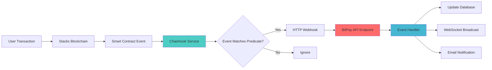
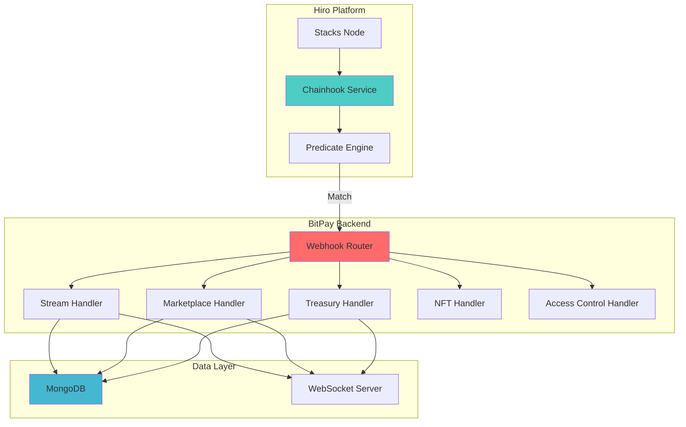
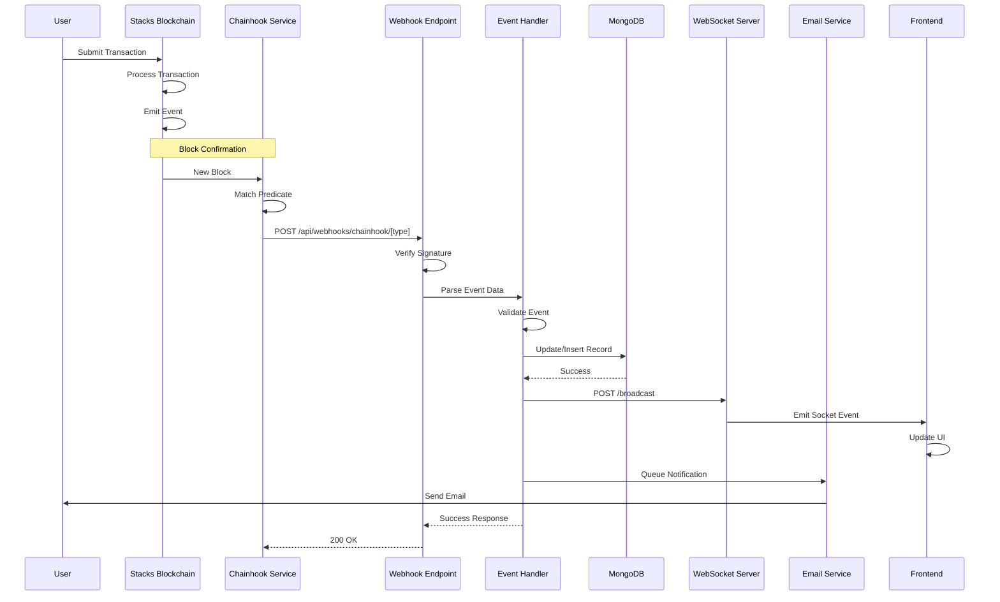
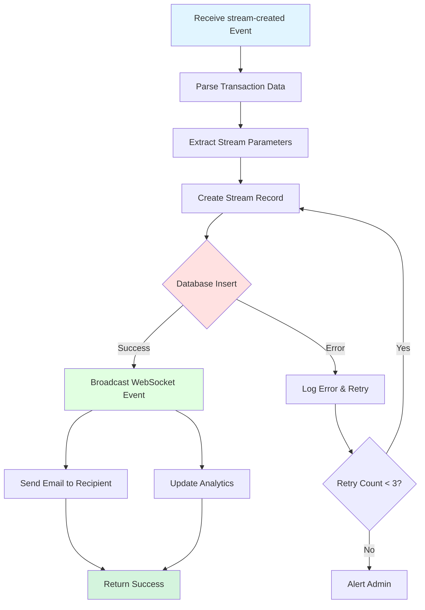
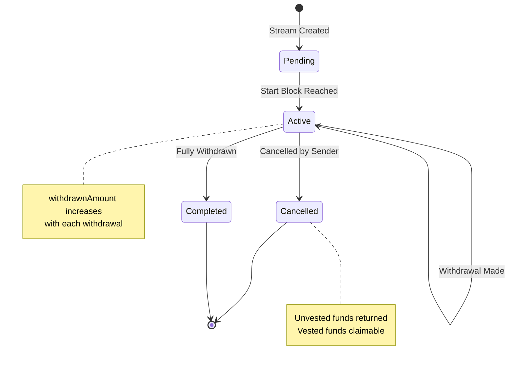
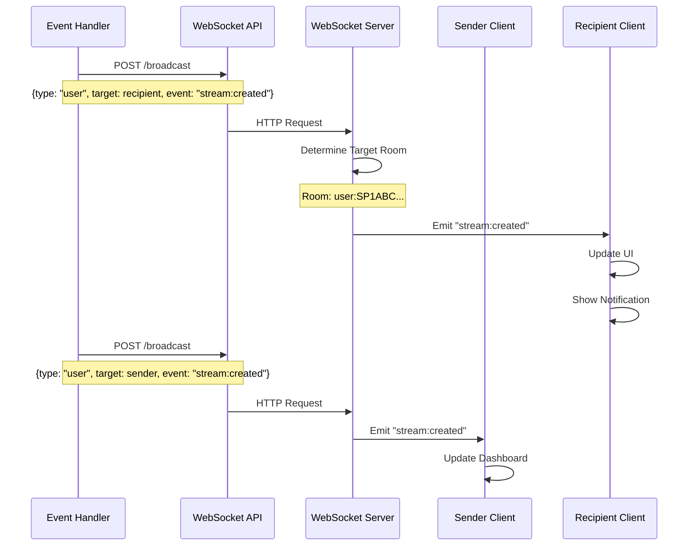
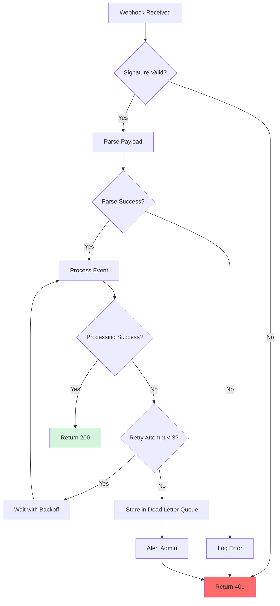

# BitPay Webhook & Chainhook Integration

Complete guide to blockchain event monitoring, webhook processing, and Chainhook integration in BitPay.

---

## Table of Contents

1. [Overview](#overview)
2. [Chainhook Architecture](#chainhook-architecture)
3. [Webhook Endpoints](#webhook-endpoints)
4. [Event Processing Flow](#event-processing-flow)
5. [Predicate Configuration](#predicate-configuration)
6. [Event Handlers](#event-handlers)
7. [Database Updates](#database-updates)
8. [WebSocket Broadcasting](#websocket-broadcasting)
9. [Error Handling](#error-handling)
10. [Testing Webhooks](#testing-webhooks)

---

## Overview

BitPay uses **Chainhook** (by Hiro) to monitor blockchain events in real-time. When smart contract functions are called, Chainhook detects the events and triggers webhooks to update the database and notify users.

### Why Chainhook?

- ✅ **Real-time** - Events processed within seconds of blockchain confirmation
- ✅ **Reliable** - Guaranteed delivery with retry logic
- ✅ **Efficient** - Only relevant events are processed
- ✅ **Scalable** - Handles high transaction volumes

### System Flow



---

## Chainhook Architecture

### High-Level Architecture



---

## Webhook Endpoints

BitPay exposes **5 webhook endpoints** for different contract events:

### 1. Stream Events Webhook

**Endpoint:** `POST /api/webhooks/chainhook/streams`

**Purpose:** Handle stream creation, withdrawal, and cancellation events

**Events:**
- `stream-created`
- `stream-withdrawal`
- `stream-cancelled`

### 2. Marketplace Events Webhook

**Endpoint:** `POST /api/webhooks/chainhook/marketplace`

**Purpose:** Handle NFT listing and purchase events

**Events:**
- `stream-listed`
- `listing-updated`
- `listing-cancelled`
- `stream-purchased`

### 3. Treasury Events Webhook

**Endpoint:** `POST /api/webhooks/chainhook/treasury`

**Purpose:** Handle treasury governance events

**Events:**
- `admin-added`
- `admin-removed`
- `proposal-created`
- `proposal-approved`
- `proposal-executed`
- `fee-collected`

### 4. NFT Events Webhook

**Endpoint:** `POST /api/webhooks/chainhook/nft`

**Purpose:** Handle NFT minting and transfer events

**Events:**
- `claim-nft-minted`
- `obligation-nft-minted`
- `obligation-nft-transferred`

### 5. Access Control Events Webhook

**Endpoint:** `POST /api/webhooks/chainhook/access-control`

**Purpose:** Handle role management events

**Events:**
- `admin-added`
- `admin-removed`
- `operator-added`
- `operator-removed`
- `emergency-pause`

---

## Event Processing Flow

### Complete Event Flow



### Webhook Request Structure

```typescript
interface ChainhookPayload {
  apply: Array<{
    block_identifier: {
      index: number;
      hash: string;
    };
    timestamp: number;
    transactions: Array<{
      transaction_identifier: {
        hash: string;
      };
      operations: Array<{
        type: string;
        status: string;
        account: {
          address: string;
        };
      }>;
      metadata: {
        receipt: {
          events: Array<{
            type: string;
            data: {
              contract_identifier: string;
              topic: string;
              value: any;
            };
          }>;
        };
      };
    }>;
  }>;
}
```

---

## Predicate Configuration

### What are Predicates?

Predicates are **filters** that tell Chainhook which blockchain events to monitor and trigger webhooks for.

### Stream Events Predicate

```json
{
  "chain": "stacks",
  "uuid": "bitpay-streams-v1",
  "name": "BitPay Stream Events",
  "version": 1,
  "networks": {
    "testnet": {
      "if_this": {
        "scope": "contract_call",
        "contract_identifier": "ST2F3J1PK46D6XVRBB9SQ66PY89P8G0EBDW5E05M7.bitpay-core",
        "method": ["create-stream", "withdraw-from-stream", "cancel-stream"]
      },
      "then_that": {
        "http_post": {
          "url": "https://bitpay-more.vercel.app/api/webhooks/chainhook/streams",
          "authorization_header": "Bearer YOUR_SECRET_TOKEN"
        }
      }
    }
  }
}
```

### Marketplace Events Predicate

```json
{
  "chain": "stacks",
  "uuid": "bitpay-marketplace-v1",
  "name": "BitPay Marketplace Events",
  "version": 1,
  "networks": {
    "testnet": {
      "if_this": {
        "scope": "contract_call",
        "contract_identifier": "ST2F3J1PK46D6XVRBB9SQ66PY89P8G0EBDW5E05M7.bitpay-marketplace",
        "method": ["list-stream", "update-listing", "cancel-listing", "purchase-stream"]
      },
      "then_that": {
        "http_post": {
          "url": "https://bitpay-more.vercel.app/api/webhooks/chainhook/marketplace",
          "authorization_header": "Bearer YOUR_SECRET_TOKEN"
        }
      }
    }
  }
}
```

### Treasury Events Predicate

```json
{
  "chain": "stacks",
  "uuid": "bitpay-treasury-v1",
  "name": "BitPay Treasury Events",
  "version": 1,
  "networks": {
    "testnet": {
      "if_this": {
        "scope": "contract_call",
        "contract_identifier": "ST2F3J1PK46D6XVRBB9SQ66PY89P8G0EBDW5E05M7.bitpay-treasury",
        "method": ["add-admin", "remove-admin", "create-withdrawal-proposal", "approve-proposal", "execute-proposal"]
      },
      "then_that": {
        "http_post": {
          "url": "https://bitpay-more.vercel.app/api/webhooks/chainhook/treasury",
          "authorization_header": "Bearer YOUR_SECRET_TOKEN"
        }
      }
    }
  }
}
```

### Deploying Predicates

```bash
# Using Hiro Platform API
curl -X POST https://api.hiro.so/chainhooks \
  -H "Authorization: Bearer YOUR_HIRO_API_KEY" \
  -H "Content-Type: application/json" \
  -d @predicate-streams.json
```

---

## Event Handlers

### Stream Events Handler

**File:** `bitpay-frontend/app/api/webhooks/chainhook/streams/route.ts`

```typescript
export async function POST(request: Request) {
  try {
    // 1. Verify Chainhook signature
    const signature = request.headers.get('authorization');
    if (!verifySignature(signature)) {
      return NextResponse.json({ error: 'Unauthorized' }, { status: 401 });
    }

    // 2. Parse webhook payload
    const payload: ChainhookPayload = await request.json();

    // 3. Process each transaction
    for (const apply of payload.apply) {
      for (const tx of apply.transactions) {
        // 4. Determine event type
        const eventType = determineEventType(tx);

        // 5. Route to appropriate handler
        switch (eventType) {
          case 'stream-created':
            await handleStreamCreated(tx, apply.block_identifier);
            break;
          case 'stream-withdrawal':
            await handleWithdrawal(tx, apply.block_identifier);
            break;
          case 'stream-cancelled':
            await handleCancellation(tx, apply.block_identifier);
            break;
        }
      }
    }

    return NextResponse.json({ success: true });
  } catch (error) {
    console.error('Webhook processing error:', error);
    return NextResponse.json({ error: 'Internal error' }, { status: 500 });
  }
}
```

### Stream Creation Handler



**Implementation:**

```typescript
async function handleStreamCreated(
  transaction: Transaction,
  blockIdentifier: BlockIdentifier
) {
  // Extract event data from contract call
  const { sender, recipient, amount, startBlock, endBlock, streamId } =
    parseStreamCreatedEvent(transaction);

  // Create database record
  const stream = await Stream.create({
    streamId,
    sender,
    recipient,
    amount,
    startBlock,
    endBlock,
    withdrawnAmount: 0,
    status: 'active',
    createdAt: new Date(blockIdentifier.timestamp * 1000),
    blockHeight: blockIdentifier.index,
    transactionHash: transaction.transaction_identifier.hash,
  });

  // Broadcast to WebSocket
  await broadcastEvent({
    type: 'user',
    target: recipient,
    event: 'stream:created',
    payload: {
      streamId: stream.streamId,
      sender: stream.sender,
      amount: stream.amount,
      duration: endBlock - startBlock,
    },
  });

  // Also broadcast to sender
  await broadcastEvent({
    type: 'user',
    target: sender,
    event: 'stream:created',
    payload: {
      streamId: stream.streamId,
      recipient: stream.recipient,
      amount: stream.amount,
    },
  });

  // Send email notification
  await sendEmail({
    to: recipient,
    template: 'stream-created',
    data: {
      sender,
      amount: formatSatoshis(amount),
      streamId,
      dashboardUrl: `${process.env.NEXT_PUBLIC_APP_URL}/dashboard/streams/${streamId}`,
    },
  });

  // Update analytics
  await Analytics.increment('streams.created');
  await Analytics.increment('streams.total_value', amount);
}
```

### Withdrawal Handler

```typescript
async function handleWithdrawal(
  transaction: Transaction,
  blockIdentifier: BlockIdentifier
) {
  const { streamId, recipient, amount } = parseWithdrawalEvent(transaction);

  // Update stream record
  const stream = await Stream.findOneAndUpdate(
    { streamId },
    {
      $inc: { withdrawnAmount: amount },
      $set: {
        lastWithdrawalAt: new Date(blockIdentifier.timestamp * 1000),
        lastWithdrawalBlock: blockIdentifier.index,
      },
    },
    { new: true }
  );

  // Check if stream is now completed
  if (stream.withdrawnAmount >= stream.amount) {
    stream.status = 'completed';
    await stream.save();
  }

  // Broadcast update
  await broadcastEvent({
    type: 'stream',
    target: streamId.toString(),
    event: 'stream:withdrawal',
    payload: {
      streamId,
      amount,
      totalWithdrawn: stream.withdrawnAmount,
      remaining: stream.amount - stream.withdrawnAmount,
    },
  });

  // Notify sender
  await broadcastEvent({
    type: 'user',
    target: stream.sender,
    event: 'stream:withdrawal',
    payload: { streamId, amount, recipient },
  });
}
```

### Cancellation Handler

```typescript
async function handleCancellation(
  transaction: Transaction,
  blockIdentifier: BlockIdentifier
) {
  const { streamId, sender, vestedAmount, unvestedAmount } =
    parseCancellationEvent(transaction);

  // Update stream record
  const stream = await Stream.findOneAndUpdate(
    { streamId },
    {
      $set: {
        status: 'cancelled',
        cancelledAt: new Date(blockIdentifier.timestamp * 1000),
        cancelledAtBlock: blockIdentifier.index,
      },
    },
    { new: true }
  );

  // Broadcast cancellation
  await broadcastEvent({
    type: 'stream',
    target: streamId.toString(),
    event: 'stream:cancelled',
    payload: {
      streamId,
      vestedAmount,
      unvestedAmount,
      cancelledBy: sender,
    },
  });

  // Notify both parties
  await Promise.all([
    broadcastEvent({
      type: 'user',
      target: stream.recipient,
      event: 'stream:cancelled',
      payload: { streamId, remainingVested: vestedAmount },
    }),
    sendEmail({
      to: stream.recipient,
      template: 'stream-cancelled',
      data: { streamId, remainingVested: formatSatoshis(vestedAmount) },
    }),
  ]);
}
```

---

## Database Updates

### Stream Record Updates



### Database Schema Updates

**On Stream Creation:**
```javascript
{
  streamId: 123,
  sender: "SP...",
  recipient: "SP...",
  amount: 1000000, // satoshis
  startBlock: 150000,
  endBlock: 160000,
  withdrawnAmount: 0,
  status: "active",
  createdAt: ISODate("2025-01-15T10:00:00Z"),
  blockHeight: 150000,
  transactionHash: "0xabc..."
}
```

**On Withdrawal:**
```javascript
{
  $inc: { withdrawnAmount: 100000 },
  $set: {
    lastWithdrawalAt: ISODate("2025-01-16T10:00:00Z"),
    lastWithdrawalBlock: 151000
  }
}
```

**On Cancellation:**
```javascript
{
  $set: {
    status: "cancelled",
    cancelledAt: ISODate("2025-01-17T10:00:00Z"),
    cancelledAtBlock: 152000
  }
}
```

---

## WebSocket Broadcasting

### Broadcasting Flow



### Broadcast Helper Function

```typescript
async function broadcastEvent(event: {
  type: 'user' | 'stream' | 'marketplace' | 'treasury' | 'global';
  target?: string;
  event: string;
  payload: any;
}) {
  const wsUrl = process.env.SOCKET_SERVER_URL || 'http://localhost:4000';

  try {
    const response = await fetch(`${wsUrl}/broadcast`, {
      method: 'POST',
      headers: { 'Content-Type': 'application/json' },
      body: JSON.stringify(event),
    });

    if (!response.ok) {
      throw new Error(`WebSocket broadcast failed: ${response.statusText}`);
    }
  } catch (error) {
    console.error('WebSocket broadcast error:', error);
    // Don't fail the webhook processing if WebSocket fails
  }
}
```

---

## Error Handling

### Error Handling Strategy



### Error Types & Responses

```typescript
// 1. Authentication Error
if (!verifySignature(signature)) {
  return NextResponse.json(
    { error: 'Invalid signature' },
    { status: 401 }
  );
}

// 2. Validation Error
if (!isValidPayload(payload)) {
  return NextResponse.json(
    { error: 'Invalid payload structure' },
    { status: 400 }
  );
}

// 3. Database Error (Retryable)
try {
  await updateDatabase(data);
} catch (error) {
  if (isRetryable(error)) {
    // Chainhook will retry based on response code
    return NextResponse.json(
      { error: 'Database temporarily unavailable' },
      { status: 503 }
    );
  } else {
    // Permanent failure
    await storeInDeadLetterQueue(payload);
    return NextResponse.json(
      { error: 'Permanent processing error' },
      { status: 500 }
    );
  }
}

// 4. Success
return NextResponse.json({ success: true }, { status: 200 });
```

### Dead Letter Queue

```typescript
interface DeadLetterRecord {
  payload: ChainhookPayload;
  error: string;
  timestamp: Date;
  retryCount: number;
}

async function storeInDeadLetterQueue(
  payload: ChainhookPayload,
  error: Error
) {
  await DeadLetter.create({
    payload,
    error: error.message,
    timestamp: new Date(),
    retryCount: 0,
  });

  // Alert admin
  await sendAdminAlert({
    subject: 'Webhook Processing Failed',
    body: `Event could not be processed: ${error.message}`,
  });
}
```

---

## Testing Webhooks

### Local Testing with ngrok

```bash
# 1. Start local development server
cd bitpay-frontend
npm run dev

# 2. Start ngrok tunnel
ngrok http 3000

# Output: https://abc123.ngrok.io -> http://localhost:3000

# 3. Update predicate with ngrok URL
{
  "then_that": {
    "http_post": {
      "url": "https://abc123.ngrok.io/api/webhooks/chainhook/streams",
      "authorization_header": "Bearer YOUR_SECRET_TOKEN"
    }
  }
}
```

### Manual Webhook Testing

```bash
# Test payload structure
curl -X POST http://localhost:3000/api/webhooks/chainhook/streams \
  -H "Content-Type: application/json" \
  -H "Authorization: Bearer YOUR_SECRET_TOKEN" \
  -d @test-payload.json
```

**Test Payload Example:**

```json
{
  "apply": [
    {
      "block_identifier": {
        "index": 150000,
        "hash": "0xabc123"
      },
      "timestamp": 1705392000,
      "transactions": [
        {
          "transaction_identifier": {
            "hash": "0xdef456"
          },
          "operations": [],
          "metadata": {
            "receipt": {
              "events": [
                {
                  "type": "contract_event",
                  "data": {
                    "contract_identifier": "ST2F3J1PK46D6XVRBB9SQ66PY89P8G0EBDW5E05M7.bitpay-core",
                    "topic": "print",
                    "value": {
                      "event": "stream-created",
                      "stream-id": "u1",
                      "sender": "ST2F3J1PK46D6XVRBB9SQ66PY89P8G0EBDW5E05M7",
                      "recipient": "ST1PQHQKV0RJXZFY1DGX8MNSNYVE3VGZJSRTPGZGM",
                      "amount": "u1000000",
                      "start-block": "u150000",
                      "end-block": "u160000"
                    }
                  }
                }
              ]
            }
          }
        }
      ]
    }
  ]
}
```

### Integration Tests

```typescript
describe('Stream Webhook Handler', () => {
  it('should create stream record on stream-created event', async () => {
    const payload = createMockPayload('stream-created');

    const response = await POST(
      new Request('http://localhost/api/webhooks/chainhook/streams', {
        method: 'POST',
        headers: {
          'Content-Type': 'application/json',
          Authorization: `Bearer ${process.env.CHAINHOOK_SECRET_TOKEN}`,
        },
        body: JSON.stringify(payload),
      })
    );

    expect(response.status).toBe(200);

    const stream = await Stream.findOne({ streamId: 1 });
    expect(stream).toBeDefined();
    expect(stream.sender).toBe('ST2F3J1PK46D6XVRBB9SQ66PY89P8G0EBDW5E05M7');
  });
});
```

---

## Monitoring & Observability

### Webhook Metrics

```typescript
// Track webhook processing
await Analytics.track('webhook.received', {
  type: 'streams',
  transactionHash: tx.transaction_identifier.hash,
});

await Analytics.track('webhook.processed', {
  type: 'streams',
  duration: Date.now() - startTime,
});

// Track errors
await Analytics.track('webhook.error', {
  type: 'streams',
  error: error.message,
});
```

### Logging Best Practices

```typescript
console.log('[Webhook] Received stream-created event', {
  streamId,
  sender,
  recipient,
  amount,
  blockHeight: blockIdentifier.index,
  txHash: transaction.transaction_identifier.hash,
});

console.error('[Webhook] Processing failed', {
  error: error.message,
  stack: error.stack,
  payload: JSON.stringify(payload),
});
```

---

## Next Steps

- [WebSocket Communication](WEBSOCKET.md)
- [Frontend Architecture](FRONTEND.md)
- [Smart Contracts](CONTRACTS.md)
- [Deployment Guide](DEPLOYMENT.md)
