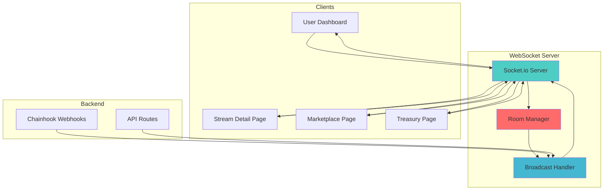
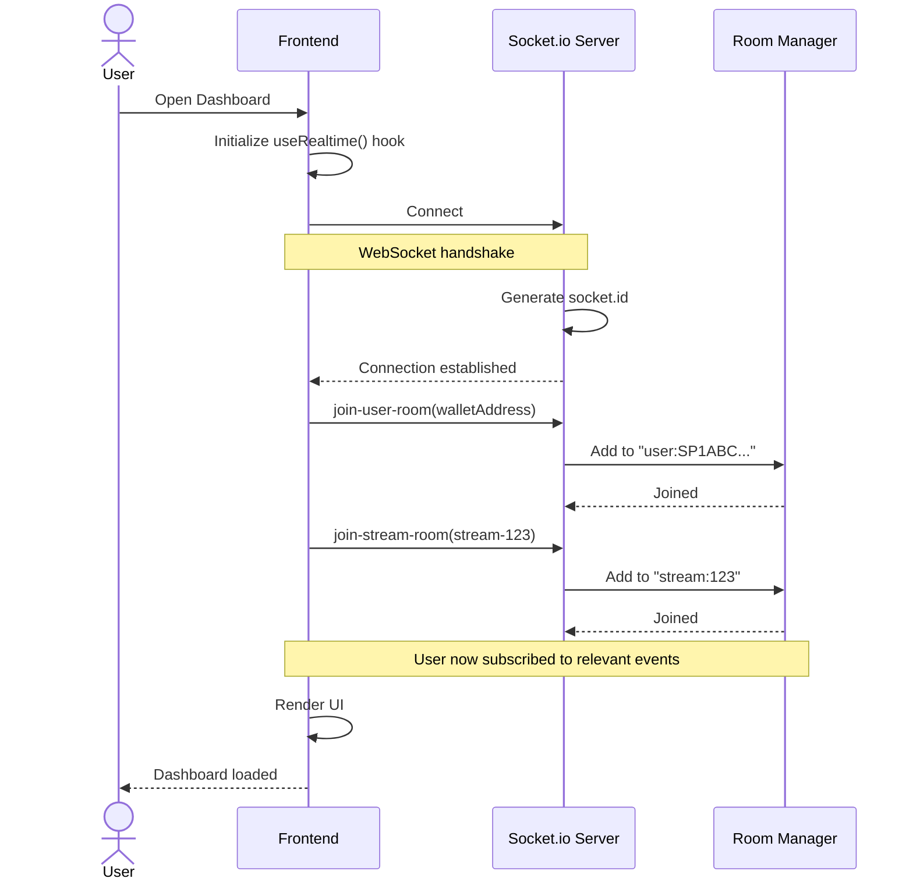
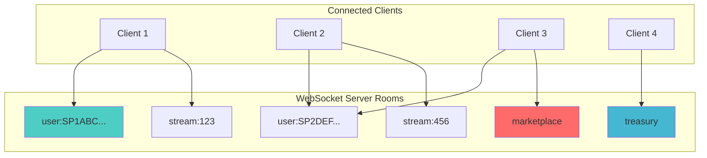
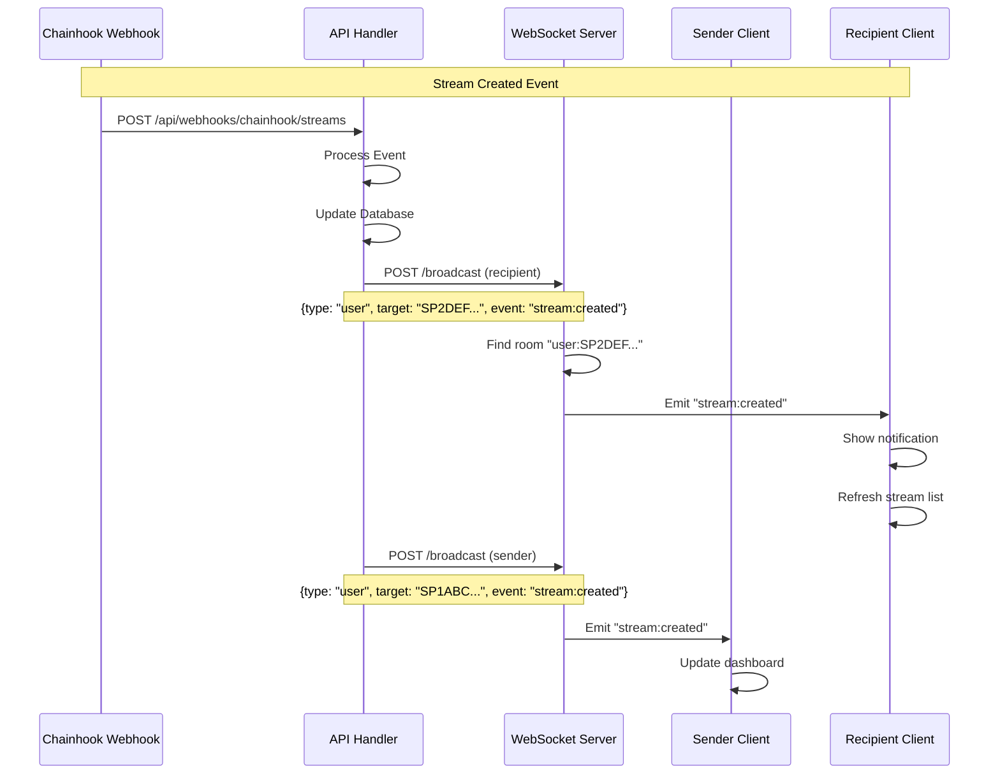
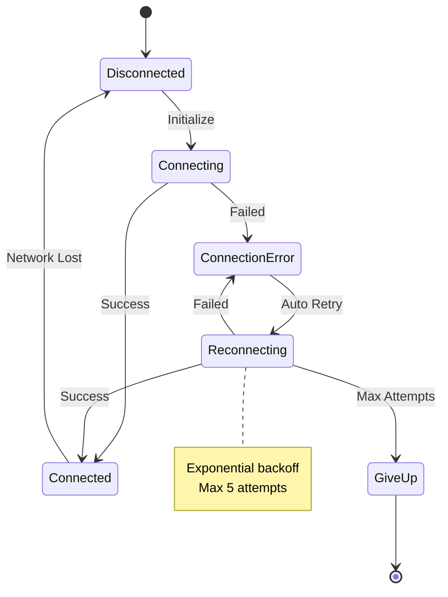
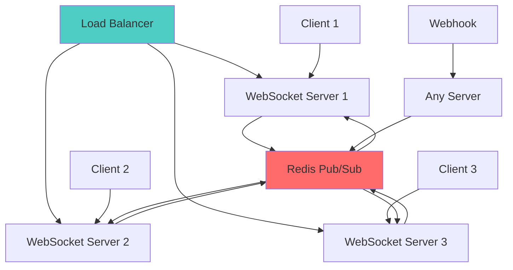

# BitPay WebSocket Real-Time Communication

Complete guide to real-time updates, WebSocket architecture, and event broadcasting in BitPay.

---

## Table of Contents

1. [Overview](#overview)
2. [WebSocket Server Architecture](#websocket-server-architecture)
3. [Connection Management](#connection-management)
4. [Room-Based Broadcasting](#room-based-broadcasting)
5. [Event Types](#event-types)
6. [Client Integration](#client-integration)
7. [Broadcasting from Backend](#broadcasting-from-backend)
8. [Error Handling & Reconnection](#error-handling--reconnection)
9. [Scaling Considerations](#scaling-considerations)
10. [Testing](#testing)

---

## Overview

BitPay uses **Socket.io** for real-time communication between the server and clients. This enables instant updates when blockchain events occur without polling.

### Why WebSocket?

- ✅ **Real-time** - Updates appear instantly (< 1 second)
- ✅ **Efficient** - No polling, reduces server load
- ✅ **Targeted** - Only relevant users receive updates
- ✅ **Bidirectional** - Two-way communication
- ✅ **Reliable** - Automatic reconnection

### Architecture Overview



---

## WebSocket Server Architecture

### Server Implementation

**Location:** `bitpay-websocket-server/server.js`

```javascript
const { createServer } = require('http');
const { Server } = require('socket.io');

const PORT = process.env.PORT || 4000;
const ALLOWED_ORIGINS = process.env.ALLOWED_ORIGINS
  ? process.env.ALLOWED_ORIGINS.split(',')
  : ['http://localhost:3000', 'https://bitpay-more.vercel.app'];

// Create HTTP server
const httpServer = createServer((req, res) => {
  // Health check endpoint
  if (req.url === '/health' && req.method === 'GET') {
    res.writeHead(200, { 'Content-Type': 'application/json' });
    res.end(JSON.stringify({ status: 'ok', timestamp: new Date().toISOString() }));
    return;
  }

  // Broadcast endpoint (for webhooks to trigger broadcasts)
  if (req.url === '/broadcast' && req.method === 'POST') {
    let body = '';
    req.on('data', chunk => { body += chunk.toString(); });
    req.on('end', () => {
      try {
        const data = JSON.parse(body);
        handleBroadcast(data);
        res.writeHead(200, { 'Content-Type': 'application/json' });
        res.end(JSON.stringify({ success: true }));
      } catch (err) {
        res.writeHead(400, { 'Content-Type': 'application/json' });
        res.end(JSON.stringify({ error: 'Invalid request' }));
      }
    });
    return;
  }

  res.writeHead(404);
  res.end('Not Found');
});

// Initialize Socket.io
const io = new Server(httpServer, {
  cors: {
    origin: ALLOWED_ORIGINS,
    methods: ['GET', 'POST'],
    credentials: true,
  },
  path: '/socket.io',
  transports: ['websocket', 'polling'],
});
```

### Connection Flow



---

## Connection Management

### Server-Side Connection Handling

```javascript
io.on('connection', (socket) => {
  console.log('🔌 Client connected:', socket.id);

  // Join user-specific room based on wallet address
  socket.on('join-user-room', (walletAddress) => {
    if (walletAddress) {
      socket.join(`user:${walletAddress}`);
      console.log(`👤 User ${walletAddress} joined their room`);
    }
  });

  // Join stream-specific room
  socket.on('join-stream-room', (streamId) => {
    if (streamId) {
      socket.join(`stream:${streamId}`);
      console.log(`📊 Client joined stream room: ${streamId}`);
    }
  });

  // Leave stream room
  socket.on('leave-stream-room', (streamId) => {
    if (streamId) {
      socket.leave(`stream:${streamId}`);
      console.log(`📊 Client left stream room: ${streamId}`);
    }
  });

  // Join marketplace room
  socket.on('join-marketplace', () => {
    socket.join('marketplace');
    console.log('🛒 Client joined marketplace room');
  });

  // Join treasury room
  socket.on('join-treasury', () => {
    socket.join('treasury');
    console.log('🏦 Client joined treasury room');
  });

  socket.on('disconnect', () => {
    console.log('🔌 Client disconnected:', socket.id);
  });
});
```

### Client-Side Connection Hook

**Location:** `bitpay-frontend/hooks/use-realtime.ts`

```typescript
'use client';

import { useEffect, useState, useCallback } from 'react';
import { io, Socket } from 'socket.io-client';
import { useAuth } from '@/hooks/use-auth';

let socket: Socket | null = null;

export function useRealtime() {
  const { user } = useAuth();
  const [isConnected, setIsConnected] = useState(false);

  useEffect(() => {
    // Initialize socket connection
    if (!socket) {
      const socketUrl = process.env.NEXT_PUBLIC_SOCKET_URL || 'http://localhost:4000';

      socket = io(socketUrl, {
        path: '/socket.io',
        transports: ['websocket', 'polling'],
        reconnection: true,
        reconnectionDelay: 1000,
        reconnectionAttempts: 5,
      });

      socket.on('connect', () => {
        console.log('✅ WebSocket connected:', socket?.id);
        setIsConnected(true);
      });

      socket.on('disconnect', () => {
        console.log('❌ WebSocket disconnected');
        setIsConnected(false);
      });

      socket.on('connect_error', (error) => {
        console.error('WebSocket connection error:', error);
      });
    }

    // Join user-specific room if authenticated
    if (user?.walletAddress && socket) {
      socket.emit('join-user-room', user.walletAddress);
    }

    return () => {
      // Don't disconnect on unmount, keep connection alive
    };
  }, [user?.walletAddress]);

  const subscribe = useCallback((eventName: string, callback: (data: any) => void) => {
    if (!socket) return;

    socket.on(eventName, callback);

    return () => {
      socket?.off(eventName, callback);
    };
  }, []);

  const joinStream = useCallback((streamId: string) => {
    if (socket) {
      socket.emit('join-stream-room', streamId);
    }
  }, []);

  const leaveStream = useCallback((streamId: string) => {
    if (socket) {
      socket.emit('leave-stream-room', streamId);
    }
  }, []);

  const joinMarketplace = useCallback(() => {
    if (socket) {
      socket.emit('join-marketplace');
    }
  }, []);

  const joinTreasury = useCallback(() => {
    if (socket) {
      socket.emit('join-treasury');
    }
  }, []);

  return {
    isConnected,
    subscribe,
    joinStream,
    leaveStream,
    joinMarketplace,
    joinTreasury,
    socket,
  };
}
```

---

## Room-Based Broadcasting

### Room Architecture



### Room Types

| Room Type | Pattern | Purpose | Example |
|-----------|---------|---------|---------|
| **User Room** | `user:{walletAddress}` | Personal notifications | `user:SP1ABC...` |
| **Stream Room** | `stream:{streamId}` | Stream-specific updates | `stream:123` |
| **Marketplace Room** | `marketplace` | All marketplace activity | `marketplace` |
| **Treasury Room** | `treasury` | Treasury governance events | `treasury` |
| **Global Room** | (all clients) | System-wide announcements | N/A |

### Broadcast Handler

```javascript
function handleBroadcast(data) {
  const { type, target, event, payload } = data;

  switch (type) {
    case 'user':
      io.to(`user:${target}`).emit(event, payload);
      console.log(`📤 Broadcast to user ${target}:`, event);
      break;

    case 'stream':
      io.to(`stream:${target}`).emit(event, payload);
      console.log(`📤 Broadcast to stream ${target}:`, event);
      break;

    case 'marketplace':
      io.to('marketplace').emit(event, payload);
      console.log(`📤 Broadcast to marketplace:`, event);
      break;

    case 'treasury':
      io.to('treasury').emit(event, payload);
      console.log(`📤 Broadcast to treasury:`, event);
      break;

    case 'global':
      io.emit(event, payload);
      console.log(`📤 Global broadcast:`, event);
      break;

    default:
      console.warn('Unknown broadcast type:', type);
  }
}
```

### Broadcast Flow Example



---

## Event Types

### Stream Events

```typescript
// Stream created
socket.on('stream:created', (data: {
  streamId: number;
  sender: string;
  recipient: string;
  amount: number;
  startBlock: number;
  endBlock: number;
  duration: number;
}) => {
  // Handle new stream notification
});

// Withdrawal made
socket.on('stream:withdrawal', (data: {
  streamId: number;
  amount: number;
  totalWithdrawn: number;
  remaining: number;
}) => {
  // Update stream progress
});

// Stream cancelled
socket.on('stream:cancelled', (data: {
  streamId: number;
  vestedAmount: number;
  unvestedAmount: number;
  cancelledBy: string;
}) => {
  // Handle cancellation
});

// Stream updated (real-time vesting)
socket.on('stream:updated', (data: {
  streamId: number;
  withdrawableAmount: number;
  percentComplete: number;
}) => {
  // Update progress bar
});
```

### Marketplace Events

```typescript
// New listing
socket.on('marketplace:new-listing', (data: {
  listingId: number;
  streamId: number;
  seller: string;
  price: number;
}) => {
  // Add to marketplace feed
});

// Listing updated
socket.on('marketplace:listing-updated', (data: {
  listingId: number;
  newPrice: number;
}) => {
  // Update listing card
});

// Listing cancelled
socket.on('marketplace:listing-cancelled', (data: {
  listingId: number;
  streamId: number;
}) => {
  // Remove from marketplace
});

// Sale completed
socket.on('marketplace:sale', (data: {
  listingId: number;
  streamId: number;
  buyer: string;
  seller: string;
  price: number;
}) => {
  // Show sale notification
});
```

### Treasury Events

```typescript
// Proposal created
socket.on('treasury:proposal-created', (data: {
  proposalId: number;
  recipient: string;
  amount: number;
  description: string;
  proposer: string;
}) => {
  // Show new proposal
});

// Proposal approved
socket.on('treasury:proposal-approved', (data: {
  proposalId: number;
  approver: string;
  approvalsCount: number;
  threshold: number;
}) => {
  // Update approval count
});

// Proposal executed
socket.on('treasury:proposal-executed', (data: {
  proposalId: number;
  recipient: string;
  amount: number;
}) => {
  // Mark as executed
});

// Balance updated
socket.on('treasury:balance-updated', (data: {
  newBalance: number;
  change: number;
}) => {
  // Update treasury balance display
});
```

---

## Client Integration

### Using Stream Events Hook

```typescript
'use client';

import { useStreamEvents } from '@/hooks/use-realtime';

export default function StreamDetailPage({ streamId }: { streamId: string }) {
  const { streamData, lastEvent, isConnected } = useStreamEvents(streamId);

  useEffect(() => {
    if (lastEvent?.type === 'stream:withdrawal') {
      toast.success('Withdrawal detected!');
      // UI automatically updates via streamData
    }

    if (lastEvent?.type === 'stream:cancelled') {
      toast.warning('Stream has been cancelled');
      router.push('/dashboard/streams');
    }
  }, [lastEvent]);

  return (
    <div>
      <ConnectionIndicator connected={isConnected} />

      {streamData && (
        <StreamProgress
          amount={streamData.amount}
          withdrawn={streamData.withdrawn}
          withdrawable={streamData.withdrawable}
        />
      )}
    </div>
  );
}
```

### Using User Events Hook

```typescript
'use client';

import { useUserEvents } from '@/hooks/use-realtime';

export default function Dashboard() {
  const { events, isConnected } = useUserEvents();

  useEffect(() => {
    events.forEach((event) => {
      switch (event.type) {
        case 'stream:created':
          if (event.role === 'recipient') {
            showNotification('New stream received!', event.data);
          }
          break;

        case 'stream:withdrawal':
          if (event.role === 'sender') {
            showNotification('Withdrawal made', event.data);
          }
          break;

        case 'marketplace:sale':
          showNotification('Your listing sold!', event.data);
          break;
      }
    });
  }, [events]);

  return (
    <div>
      <LiveActivityFeed events={events} />
    </div>
  );
}
```

### Using Marketplace Events Hook

```typescript
'use client';

import { useMarketplaceEvents } from '@/hooks/use-realtime';

export default function MarketplacePage() {
  const { listings, sales, isConnected } = useMarketplaceEvents();

  return (
    <div>
      <h2>Live Listings</h2>
      <div className="grid">
        {listings.map((listing) => (
          <ListingCard
            key={listing.listingId}
            listing={listing}
            isLive={true}
          />
        ))}
      </div>

      <h2>Recent Sales</h2>
      <SalesTimeline sales={sales} />
    </div>
  );
}
```

---

## Broadcasting from Backend

### From Webhook Handler

```typescript
// After processing webhook event
async function handleStreamCreated(streamData) {
  // Update database
  await Stream.create(streamData);

  // Broadcast to recipient
  await broadcastEvent({
    type: 'user',
    target: streamData.recipient,
    event: 'stream:created',
    payload: {
      streamId: streamData.streamId,
      sender: streamData.sender,
      amount: streamData.amount,
    },
  });

  // Broadcast to sender
  await broadcastEvent({
    type: 'user',
    target: streamData.sender,
    event: 'stream:created',
    payload: {
      streamId: streamData.streamId,
      recipient: streamData.recipient,
      amount: streamData.amount,
    },
  });

  // Broadcast to stream room
  await broadcastEvent({
    type: 'stream',
    target: streamData.streamId.toString(),
    event: 'stream:updated',
    payload: streamData,
  });
}
```

### From API Route

```typescript
// app/api/streams/[id]/withdraw/route.ts
export async function POST(request: Request) {
  // Process withdrawal...

  // Broadcast update
  await fetch(`${process.env.SOCKET_SERVER_URL}/broadcast`, {
    method: 'POST',
    headers: { 'Content-Type': 'application/json' },
    body: JSON.stringify({
      type: 'stream',
      target: streamId,
      event: 'stream:updated',
      payload: {
        streamId,
        withdrawableAmount: newWithdrawableAmount,
        percentComplete: percentComplete,
      },
    }),
  });

  return NextResponse.json({ success: true });
}
```

---

## Error Handling & Reconnection

### Connection States



### Client-Side Error Handling

```typescript
export function useRealtime() {
  const [connectionState, setConnectionState] = useState<
    'disconnected' | 'connecting' | 'connected' | 'error'
  >('disconnected');

  useEffect(() => {
    if (!socket) {
      socket = io(socketUrl, {
        reconnection: true,
        reconnectionDelay: 1000,
        reconnectionDelayMax: 5000,
        reconnectionAttempts: 5,
      });

      socket.on('connect', () => {
        console.log('✅ Connected');
        setConnectionState('connected');
      });

      socket.on('disconnect', (reason) => {
        console.log('❌ Disconnected:', reason);
        setConnectionState('disconnected');

        if (reason === 'io server disconnect') {
          // Server forcefully disconnected, reconnect manually
          socket.connect();
        }
      });

      socket.on('connect_error', (error) => {
        console.error('Connection error:', error);
        setConnectionState('error');
      });

      socket.on('reconnect', (attemptNumber) => {
        console.log(`✅ Reconnected after ${attemptNumber} attempts`);
        setConnectionState('connected');

        // Re-join rooms after reconnection
        if (user?.walletAddress) {
          socket.emit('join-user-room', user.walletAddress);
        }
      });

      socket.on('reconnect_error', (error) => {
        console.error('Reconnection error:', error);
      });

      socket.on('reconnect_failed', () => {
        console.error('❌ Reconnection failed after max attempts');
        setConnectionState('error');
        // Show user notification to refresh page
      });
    }
  }, []);

  return { connectionState, /* ... */ };
}
```

### Connection Indicator Component

```typescript
function ConnectionIndicator({ connected }: { connected: boolean }) {
  return (
    <div className="flex items-center gap-2">
      <div
        className={`h-2 w-2 rounded-full ${
          connected ? 'bg-green-500' : 'bg-red-500 animate-pulse'
        }`}
      />
      <span className="text-xs text-muted-foreground">
        {connected ? 'Live' : 'Reconnecting...'}
      </span>
    </div>
  );
}
```

---

## Scaling Considerations

### Horizontal Scaling with Redis Adapter

```javascript
// For multiple WebSocket server instances
const { createAdapter } = require('@socket.io/redis-adapter');
const { createClient } = require('redis');

const pubClient = createClient({ url: process.env.REDIS_URL });
const subClient = pubClient.duplicate();

Promise.all([pubClient.connect(), subClient.connect()]).then(() => {
  io.adapter(createAdapter(pubClient, subClient));
});
```

### Load Balancing



---

## Testing

### Manual Testing

```bash
# Test WebSocket connection
npm install -g wscat

# Connect to server
wscat -c ws://localhost:4000

# Join room
> 42["join-user-room", "SP1ABC..."]

# Listen for events
< 42["stream:created", {"streamId": 1, "amount": 1000}]
```

### Integration Tests

```typescript
import { io, Socket } from 'socket.io-client';

describe('WebSocket Integration', () => {
  let clientSocket: Socket;

  beforeAll((done) => {
    clientSocket = io('http://localhost:4000');
    clientSocket.on('connect', done);
  });

  afterAll(() => {
    clientSocket.close();
  });

  it('should receive stream:created event', (done) => {
    clientSocket.emit('join-user-room', 'SP1ABC...');

    clientSocket.on('stream:created', (data) => {
      expect(data.streamId).toBe(1);
      expect(data.amount).toBe(1000);
      done();
    });

    // Trigger event from backend
    // ...
  });
});
```

---

## Next Steps

- [Frontend Architecture](FRONTEND.md)
- [Webhook Integration](WEBHOOKS.md)
- [Smart Contracts](CONTRACTS.md)
- [Deployment Guide](DEPLOYMENT.md)
